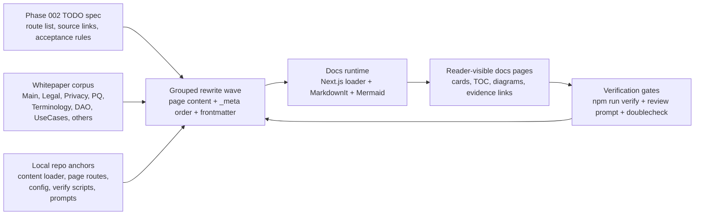

# Phase 002: New Docs - Research

**Researched:** 2026-07-10  
**Domain:** Docs corpus rewrite planning for the Z00Z website content system  
**Confidence:** HIGH

## User Constraints

- `002-TODO.md` is normative for this phase; planning must follow its route list, action verbs, source-link expectations, diagram requirements, and acceptance criteria exactly. [CITED: .planning/phases/002-New-Docs/002-TODO.md]
- Write the research artifact in English, do not edit `ROADMAP.md` or `STATE.md`, and do not create `PLAN` files during this run. [VERIFIED: current task prompt]
- Explicitly preserve the fact that the live `002-TODO.md` currently contains **0** `TASK-NNN` rows; planner-owned grouped identifiers are required because there is no task-row ID inventory to inherit. [VERIFIED: rg -n "TASK-[0-9]{3}" .planning/phases/002-New-Docs/002-TODO.md]
- `CONTEXT.md` is absent for Phase 002, so there are no locked discuss-phase decisions to copy verbatim into this artifact. [VERIFIED: ls .planning/phases/002-New-Docs/*-CONTEXT.md]

## Project Constraints (from AGENTS.md)

- Use repository docs, planning files, and source code directly; keep instruction lookup on canonical `.github/*` paths and treat mirrors/caches as non-authoritative. [CITED: AGENTS.md]
- Keep website source placement aligned with the current repo shape: `src/app/` for routes, `src/` for shared source, `content/` for content, `config/` for configuration, `public/` for runtime assets, and do not place application code under `public/`. [CITED: AGENTS.md]
- Use compact output discipline and avoid unnecessary prose; for implementation work, prefer code/content changes over commentary. [CITED: AGENTS.md]
- Start GSD work by loading the matching local skill, and keep repository artifacts in English. [CITED: AGENTS.md]
- The inherited repository-wide operating surface also applies from `/home/vadim/Projects/z00z/.github/copilot-instructions.md`: no destructive `rm`, use safe full-overwrite backups when applicable, keep technical artifacts in English, and treat `/home/vadim/Projects/z00z/.github/requirements/Z00Z_DESIGN_FOUNDATION.md` as a hard design gate. [CITED: /home/vadim/Projects/z00z/.github/copilot-instructions.md] [CITED: /home/vadim/Projects/z00z/.github/requirements/Z00Z_DESIGN_FOUNDATION.md]

<phase_requirements>
## Phase Requirements

| ID | Description | Research Support |
|----|-------------|------------------|
| DOCS-001 | Every existing `content/docs/**/*.md` page has a rewrite plan aligned to its intended role in `docs/z00z_website-design.html`. | Covered by the route inventory, section grouping seams, and the stale-path clarification that maps the missing HTML file to the current design foundation source. [CITED: .planning/REQUIREMENTS.md] [CITED: .planning/phases/002-New-Docs/002-TODO.md] [CITED: .github/requirements/Z00Z_WEB_DESIGN_FOUNDATION.md] |
| DOCS-002 | Existing placeholder or stub markdown content may be fully replaced where it does not meet the target docs role. | Covered by the disposition audit showing every existing public page is explicitly assigned `expand`, `full rewrite`, `merge/reposition`, or delete/replace work. [CITED: .planning/REQUIREMENTS.md] [CITED: .planning/phases/002-New-Docs/002-TODO.md] |
| DOCS-003 | The rewrite covers the current docs tree page-by-page rather than only top-level section indexes. | Covered by the verified 88-page routable corpus count and the 107-entry TODO specification scope. [CITED: .planning/REQUIREMENTS.md] [VERIFIED: find content/docs -type f -name '*.md' ! -path '*/_support/*' ! -name '_meta.yaml' | wc -l] [CITED: .planning/phases/002-New-Docs/002-TODO.md] |
| DOCS-004 | Each docs page is designed for roughly 5-7 minutes of reading time. | Covered by the word-count audit showing every current public page is below the fallback 1,200-word band, which makes this a full-corpus rewrite requirement, not a selective edit. [CITED: .planning/REQUIREMENTS.md] [VERIFIED: Node word-count audit over content/docs] |
| DOCS-005 | Each page explains the core idea in smoother, more readable language for readers who are new to the topic. | Covered by the grouping recommendation that separates beginner curricula, technical protocol/system pages, operator pages, and legal/security claim pages. [CITED: .planning/REQUIREMENTS.md] [CITED: .planning/phases/002-New-Docs/002-TODO.md] |
| DOCS-006 | Each page remains technically honest and avoids fake simplification or unsupported implementation claims. | Covered by the authority-map, implementation-status, legal claim, privacy, and PQ communication gates. [CITED: .planning/REQUIREMENTS.md] [CITED: content/whitepapers/Main-Whitepaper.md] [CITED: content/whitepapers/Legal-Architecture.md] [CITED: content/whitepapers/Privacy-Threat-Model.md] [CITED: content/whitepapers/Post-Quantum-Migration.md] |
| DOCS-007 | Each page uses structure, progressive disclosure, or visual markdown patterns where they materially improve comprehension. | Covered by the markdown capability inventory and Mermaid skill requirements already named in TODO and implemented in the current renderer. [CITED: .planning/REQUIREMENTS.md] [CITED: .planning/phases/002-New-Docs/002-TODO.md] [CITED: config/content-pipeline.yaml] [CITED: src/lib/content/markdown.ts] |
| DOCS-008 | Each rewritten page is grounded in `content/whitepapers` as the main corpus. | Covered by the source-authority map and section-level authority clustering extracted from `Source links:` in the TODO. [CITED: .planning/REQUIREMENTS.md] [CITED: .planning/phases/002-New-Docs/002-TODO.md] |
| DOCS-009 | Each page links to concrete source whitepaper sections so readers can verify claims and continue into deeper technical detail. | Covered by the TODO source-link contract and the verification gap analysis showing this is not yet automated by the current repo gates. [CITED: .planning/REQUIREMENTS.md] [CITED: .planning/phases/002-New-Docs/002-TODO.md] [CITED: scripts/verify.sh] [CITED: scripts/verify-search-coverage.mjs] |
| DOCS-010 | The docs layer acts as a readable synthesis, while deeper technical detail remains in the whitepapers. | Covered by the authority hierarchy and claim-hygiene guidance that routes category, implementation-status, legal, privacy, and PQ truth back to the owning papers. [CITED: .planning/REQUIREMENTS.md] [CITED: content/whitepapers/Corpus-Terminology-Reference.md] |
| DOCS-011 | The rewrite explicitly accounts for installed `mdit-plugins` and `markdown-it` capabilities when selecting page patterns such as callouts, tabs, containers, collapsibles, footnotes, or diagrams. | Covered by the renderer capability inventory from `config/content-pipeline.yaml`, `src/lib/content/markdown.ts`, and the Mermaid enhancer components. [CITED: .planning/REQUIREMENTS.md] [CITED: config/content-pipeline.yaml] [CITED: src/lib/content/markdown.ts] [CITED: src/components/docs/MarkdownEnhancer.tsx] |
| DOCS-012 | Docs pages should feel more visual, structured, and user-friendly without becoming decorative noise. | Covered by the recommendation to use existing cards, tabs, alerts, Mermaid, TOC, and figure patterns, plus the warning that section-home authored content is currently suppressed when landing cards exist. [CITED: .planning/REQUIREMENTS.md] [CITED: src/app/docs/[[...slug]]/page.tsx] [CITED: src/components/docs/DocLandingCards.tsx] |
| DOCS-013 | Before phase closeout, the work must be doublechecked against the repository and source corpus. | Covered by the required doublecheck and review-loop gates. [CITED: .planning/REQUIREMENTS.md] [CITED: .github/skills/doublecheck/SKILL.md] [CITED: .planning/phases/002-New-Docs/002-TODO.md] |
| DOCS-014 | `/.github/prompts/gsd-review-tasks-execution.prompt.md` must be run at least 3 times in YOLO mode during docs execution. | Covered by the explicit TODO gate and the prompt’s own local-inline execution contract. [CITED: .planning/REQUIREMENTS.md] [CITED: .planning/phases/002-New-Docs/002-TODO.md] [CITED: .github/prompts/gsd-review-tasks-execution.prompt.md] |
| DOCS-015 | Review/fix cycles continue until at least 2 consecutive review runs report no significant issues. | Covered by the same review prompt contract and TODO closeout rule. [CITED: .planning/REQUIREMENTS.md] [CITED: .planning/phases/002-New-Docs/002-TODO.md] [CITED: .github/prompts/gsd-review-tasks-execution.prompt.md] |
</phase_requirements>

## Summary

Phase 002 is a **full public docs corpus rewrite**, not a partial refresh. The live spec names **107** scoped entries: **88** existing routable public markdown pages, **8** required new documents, **10** `_meta.yaml` navigation-order targets, and **1** `_support` cleanup item; there are **0** inherited `TASK-NNN` rows, so the planner must create grouped plan identifiers instead of pretending task IDs already exist. [CITED: .planning/phases/002-New-Docs/002-TODO.md] [VERIFIED: find content/docs -type f -name '*.md' ! -path '*/_support/*' ! -name '_meta.yaml' | wc -l] [VERIFIED: rg -n "TASK-[0-9]{3}" .planning/phases/002-New-Docs/002-TODO.md]

The current repository already has a working docs runtime, but its gates are **shell correctness gates**, not **Phase 002 acceptance gates**. `npm run verify` currently passes lint, search coverage, and build; however, search coverage only proves that each page title can find itself in the local search index, and it does **not** check word-count targets, source anchors, `Read Next` sections, icon-contract compliance, claim hygiene, or TODO coverage completeness. [VERIFIED: npm run verify] [CITED: scripts/verify.sh] [CITED: scripts/verify-search-coverage.mjs]

The dominant planning risk is not missing tooling; it is **spec/code drift**. The TODO requires richer section-home guides, frontmatter-owned difficulty icons, deliberate navigation order, whitepaper-section source anchors, and careful maturity/claim language, while the current runtime still suppresses authored body content on landing pages with child cards, still defaults difficulty icons to the old `mdi:alpha-*-circle-outline` family, and still allows `_meta.yaml page_icons` overrides that the TODO now rejects for ordinary public docs pages. [CITED: .planning/phases/002-New-Docs/002-TODO.md] [CITED: src/app/docs/[[...slug]]/page.tsx] [CITED: src/lib/content/docs.ts] [CITED: content/docs/_meta.yaml] [CITED: content/docs/*/_meta.yaml]

**Primary recommendation:** Plan Phase 002 as a small number of grouped execution lanes in this order: `(1)` navigation/meta contract, `(2)` section-home rendering constraint resolution, `(3)` beginner/home narratives, `(4)` protocol plus network authority-heavy pages, `(5)` developers pages tied to local code anchors, `(6)` security/legal/research claim-hygiene pages, and `(7)` support plus use-case scenarios. Every lane should carry the same cross-cutting gates: whitepaper-section evidence links, maturity-safe language, `npm run verify`, repeated `GSD-Review-Tasks-Execution` passes, and a final doublecheck pass against both repo code and corpus sources. [CITED: .planning/phases/002-New-Docs/002-TODO.md] [CITED: .github/prompts/gsd-review-tasks-execution.prompt.md] [CITED: .github/skills/doublecheck/SKILL.md]

## Architectural Responsibility Map

| Capability | Primary Tier | Secondary Tier | Rationale |
|------------|-------------|----------------|-----------|
| Docs source truth and page content | Database / Storage | Frontend Server (SSR) | Public docs live in static filesystem content under `content/docs`; the server loader reads frontmatter, body, `_meta.yaml`, and whitepaper references from disk. [CITED: config/domains.yaml] [CITED: src/lib/content/docs.ts] |
| Navigation order, section hierarchy, and section-home cards | Frontend Server (SSR) | Database / Storage | The loader builds navigation from filesystem structure and `_meta.yaml` order fields, then the page components render landing cards from that tree. [CITED: src/lib/content/docs.ts] [CITED: src/app/docs/[[...slug]]/page.tsx] |
| Markdown rendering patterns (alerts, tabs, Mermaid, footnotes, includes, collapsibles) | Frontend Server (SSR) | Browser / Client | `markdown-it` plus `@mdit/*` plugins produce HTML server-side, while tabs, Mermaid, and hash navigation are enhanced client-side. [CITED: config/content-pipeline.yaml] [CITED: src/lib/content/markdown.ts] [CITED: src/components/docs/MarkdownEnhancer.tsx] |
| Section-home authored-body visibility | Frontend Server (SSR) | Browser / Client | The route page decides `showLandingOnly = hasLandingCards`, so authored section-home body and TOC are currently hidden when child cards exist. [CITED: src/app/docs/[[...slug]]/page.tsx] |
| Search indexing and self-discovery verification | Frontend Server (SSR) | Build / Validation scripts | Search items are built from local content text and verified by a title-self-hit script, not by browser behavior. [CITED: src/lib/search.ts] [CITED: scripts/verify-search-coverage.mjs] |
| Claim hygiene, maturity labeling, and safe language | Database / Storage | Frontend Server (SSR) | The authoritative truth lives in the whitepaper corpus and repo instructions; docs pages must render those boundaries faithfully without inventing shipped status. [CITED: content/whitepapers/Legal-Architecture.md] [CITED: content/whitepapers/Privacy-Threat-Model.md] [CITED: content/whitepapers/Post-Quantum-Migration.md] [CITED: content/whitepapers/Main-Whitepaper.md] |

## Standard Stack

### Core

| Library | Version | Purpose | Why Standard |
|---------|---------|---------|--------------|
| `next` | `16.2.10` | Route rendering, build, metadata generation, dynamic docs pages | The repository already uses Next.js App Router for `/docs/[[...slug]]`, domain catchalls, and build validation; Phase 002 should not replace the route architecture. [CITED: package-lock.json] [CITED: src/app/docs/[[...slug]]/page.tsx] [CITED: src/app/docs/layout.tsx] |
| `markdown-it` | `14.3.0` | Markdown-to-HTML rendering for docs and whitepaper content | Current docs rendering, TOC extraction, link rewriting, and HTML handling all depend on the existing MarkdownIt pipeline. [CITED: package-lock.json] [CITED: src/lib/content/markdown.ts] [CITED: src/lib/content/docs.ts] |
| `@mdit/*` plugin family + `@mdit-vue/plugin-toc` | current lockfile versions including `@mdit/plugin-tab 1.0.1`, `@mdit/plugin-alert 1.0.1`, `@mdit-vue/plugin-toc 3.0.2` | Installed structured markdown patterns: alerts, tabs, containers, definition lists, footnotes, snippets, Mermaid fences, TOC, and more | TODO explicitly requires planners to use installed renderer capabilities first; these plugins are already enabled in config and code. [CITED: package-lock.json] [CITED: config/content-pipeline.yaml] [CITED: src/lib/content/markdown.ts] |
| `mermaid` | `11.16.0` | Diagram rendering for Mermaid blocks authored in docs content | Mermaid is already enabled in the markdown pipeline and enhanced client-side with panzoom and retry logic; TODO requires Mermaid-based diagrams rather than ad hoc image formats. [CITED: package-lock.json] [CITED: config/content-pipeline.yaml] [CITED: src/lib/content/markdown.ts] [CITED: src/components/docs/MarkdownEnhancer.tsx] |
| `gray-matter` + `yaml` | `4.0.3` + `2.9.0` | Frontmatter and `_meta.yaml` parsing | Frontmatter, `toc`, `difficulty`, `icon`, descriptions, and `_meta.yaml` order fields all pass through this parsing layer. [CITED: package-lock.json] [CITED: src/lib/content/docs.ts] |

### Supporting

| Library | Version | Purpose | When to Use |
|---------|---------|---------|-------------|
| `highlight.js` | repo-installed | Code block highlighting | Use existing fenced code rendering; do not introduce a second syntax-highlighting path for docs phase work. [CITED: package.json] [CITED: src/lib/content/markdown.ts] |
| `cheerio` | repo-installed | HTML post-processing and link rewriting | Use existing content rewriting and HTML parsing paths when docs need relative-link normalization or HTML shadow rendering. [CITED: package.json] [CITED: src/lib/content/docs.ts] [CITED: src/lib/content/html.ts] |
| `zod` | repo-installed | Config schema validation | The site/config layer already uses schema validation; Phase 002 should reuse it if content-validation helpers are added later. [CITED: package.json] [CITED: src/lib/config/site.ts] |

### Alternatives Considered

| Instead of | Could Use | Tradeoff |
|------------|-----------|----------|
| Existing Next.js docs route and loader | A route-system rewrite or a new docs engine | Explicitly out of scope for this phase; it would turn a docs rewrite into platform churn. [CITED: .planning/REQUIREMENTS.md] [CITED: .planning/phases/002-New-Docs/002-TODO.md] |
| Existing MarkdownIt + `@mdit/*` feature set | New markdown/MDX packages | TODO and requirements both say to use installed capabilities first; package churn is not necessary to satisfy the rewrite spec. [CITED: .planning/REQUIREMENTS.md] [CITED: config/content-pipeline.yaml] |
| Existing Mermaid skill + runtime | Static hand-drawn image assets | TODO names `mermaid-spectrum` and `mermaid-c4` as the required diagram generation surfaces. [CITED: .planning/phases/002-New-Docs/002-TODO.md] [CITED: .github/skills/mermaid-spectrum/SKILL.md] [CITED: .github/skills/mermaid-c4/SKILL.md] |

**Installation:**

```bash
# No new package installation is recommended for Phase 002.
# Use the existing workspace dependencies and current lockfile.
```

## Package Legitimacy Audit

No external package installation is required for Phase 002. The planner should treat this as a **content-and-repo-constraints phase**, not as a dependency-upgrade phase. The current workspace already builds successfully with the installed stack, and adding dependency churn would expand scope without satisfying any stated Phase 002 requirement. [VERIFIED: npm run verify] [CITED: .planning/REQUIREMENTS.md]

## Architecture Patterns

### System Architecture Diagram



This phase is best modeled as **authority-driven content production constrained by an existing renderer**, not as a feature build. The critical branch is whether section-home authored bodies can remain hidden behind landing cards; if that answer is “no,” a small early renderer adjustment is required before large content waves start. [CITED: .planning/phases/002-New-Docs/002-TODO.md] [CITED: src/app/docs/[[...slug]]/page.tsx]

### Recommended Project Structure

```text
content/docs/
├── _meta.yaml                # root docs order contract
├── index.md                  # top-level docs home
├── learn/                    # beginner curriculum
├── protocol/                 # core system and authority model
├── developers/               # repo-aware builder docs
├── network/                  # publication and operator docs
├── use-cases/                # scenario docs
├── security/                 # threat, policy, and incident docs
├── research/                 # authority map and corpus navigation
├── support/                  # troubleshooting and safe routing
└── legal/                    # claim boundaries and disclosures
```

This is the structure the planner should use for grouped execution lanes because it matches both the live content tree and the TODO navigation-order contract. [CITED: config/domains.yaml] [CITED: .planning/phases/002-New-Docs/002-TODO.md]

### Pattern 1: Navigation And Metadata Wave First

**What:** Treat all `_meta.yaml` order changes, root dead-entry cleanup, frontmatter difficulty/icon normalization, and section-home route inventory validation as one early wave. [CITED: .planning/phases/002-New-Docs/002-TODO.md] [CITED: content/docs/_meta.yaml] [CITED: content/docs/*/_meta.yaml]

**When to use:** Before any large content-writing wave, because navigation order and icon contract drift affects every section and otherwise forces repeated cleanup. [CITED: .planning/phases/002-New-Docs/002-TODO.md]

**Example:**

```yaml
# Source: .planning/phases/002-New-Docs/002-TODO.md
order:
  - index
  - learn
  - protocol
  - developers
  - network
  - use-cases
  - security
  - research
  - support
  - legal
```

### Pattern 2: Resolve Section-Home Rendering Before Writing Long Section Hubs

**What:** Decide whether section homes should continue as landing-card-only screens or whether authored body content must render above the card grid. The current page components set `showLandingOnly = hasLandingCards`, which suppresses article body and TOC for any page with children. [CITED: src/app/docs/[[...slug]]/page.tsx] [CITED: src/app/[domain]/[[...slug]]/page.tsx]

**When to use:** Before scheduling `content/docs/index.md` and every section `index.md` rewrite, because the TODO expects those pages to teach a reading path, not merely list links. [CITED: .planning/phases/002-New-Docs/002-TODO.md]

**Example:**

```typescript
// Source: src/app/docs/[[...slug]]/page.tsx
const hasLandingCards = page.landingCards.length > 0;
const showLandingOnly = hasLandingCards;
```

### Pattern 3: Group Page Plans By Dominant Authority Family, Not Only By Folder

**What:** Use folder grouping for execution logistics, but use dominant whitepaper authority families for review specialization. Verified counts from TODO source links show: `learn` is dominated by `Main-Whitepaper.md` and `Uniqueness.md`; `protocol` and `network` are dominated by `Main-Whitepaper.md` with `Privacy-Threat-Model.md` overlays; `security` is dominated by `Privacy-Threat-Model.md`; `legal` is dominated by `Legal-Architecture.md`; `use-cases` is dominated by `UseCases.md`; `research` is dominated by `Corpus-Terminology-Reference.md`; `developers` is dominated by local repo anchors plus `Main-Whitepaper.md`. [CITED: .planning/phases/002-New-Docs/002-TODO.md] [CITED: content/whitepapers/Main-Whitepaper.md] [CITED: content/whitepapers/Legal-Architecture.md] [CITED: content/whitepapers/Privacy-Threat-Model.md] [CITED: content/whitepapers/UseCases.md] [CITED: content/whitepapers/Corpus-Terminology-Reference.md]

**When to use:** When creating grouped plans, review checkpoints, or assigning reviewer mindset to a lane. [CITED: .planning/phases/002-New-Docs/002-TODO.md]

### Anti-Patterns to Avoid

- **Invented task IDs:** The live TODO has no `TASK-NNN` rows; planner-generated group IDs must be new and explicit rather than implied as inherited task numbers. [VERIFIED: rg -n "TASK-[0-9]{3}" .planning/phases/002-New-Docs/002-TODO.md]
- **Route-system rewrite disguised as content work:** Requirements explicitly exclude replacing the docs route architecture in this phase. [CITED: .planning/REQUIREMENTS.md]
- **Frontmatter/icon drift:** TODO requires `mdi:alphabet-*-box-outline` icons and discourages `_meta.yaml page_icons` overrides for ordinary docs pages, while current runtime still uses old `mdi:alpha-*-circle-outline` defaults and section-level `page_icons`. [CITED: .planning/phases/002-New-Docs/002-TODO.md] [CITED: src/lib/content/docs.ts] [CITED: content/docs/*/_meta.yaml]
- **Claim inflation:** Main, Legal, Privacy, PQ, and DAO papers all explicitly distinguish live repo evidence from target architecture and banned phrases; docs must keep that split visible. [CITED: content/whitepapers/Main-Whitepaper.md] [CITED: content/whitepapers/Legal-Architecture.md] [CITED: content/whitepapers/Privacy-Threat-Model.md] [CITED: content/whitepapers/Post-Quantum-Migration.md] [CITED: content/whitepapers/DAO.md]

## Don’t Hand-Roll

| Problem | Don’t Build | Use Instead | Why |
|---------|-------------|-------------|-----|
| Source authority mapping | Ad hoc memory of which paper “probably” owns a concept | The TODO `Source links:` blocks plus `Corpus-Terminology-Reference.md` authority map | The corpus already defines ownership by concept family and wording dispute resolution. [CITED: .planning/phases/002-New-Docs/002-TODO.md] [CITED: content/whitepapers/Corpus-Terminology-Reference.md] |
| Diagram delivery | Static one-off image assets or undocumented diagram syntax | Existing Mermaid runtime plus the required `mermaid-spectrum` and `mermaid-c4` skills | The renderer and skill layer are already installed and named by the spec. [CITED: config/content-pipeline.yaml] [CITED: src/lib/content/markdown.ts] [CITED: .github/skills/mermaid-spectrum/SKILL.md] [CITED: .github/skills/mermaid-c4/SKILL.md] |
| Navigation order and section surfacing | Hardcoded menu exceptions in React components | `_meta.yaml` order plus page frontmatter, after aligning them to the TODO contract | The docs loader already derives nav and landing cards from content metadata. [CITED: src/lib/content/docs.ts] [CITED: .planning/phases/002-New-Docs/002-TODO.md] |
| Review and completion evidence | One final manual skim | `npm run verify` + `GSD-Review-Tasks-Execution` loop + final doublecheck | TODO and requirements both require repeated review/fix loops, not a single pass. [CITED: .planning/REQUIREMENTS.md] [CITED: .github/prompts/gsd-review-tasks-execution.prompt.md] [CITED: .github/skills/doublecheck/SKILL.md] |
| Maturity and safety language | Freehand marketing copy | `Legal-Architecture.md` claims matrix, `Privacy-Threat-Model.md` anti-patterns, `Post-Quantum-Migration.md` communication guidance, and `Main-Whitepaper.md` implementation-status language | These papers already define what can be said safely and what must stay future-tense. [CITED: content/whitepapers/Legal-Architecture.md] [CITED: content/whitepapers/Privacy-Threat-Model.md] [CITED: content/whitepapers/Post-Quantum-Migration.md] [CITED: content/whitepapers/Main-Whitepaper.md] |

**Key insight:** Phase 002 succeeds by **reusing the current content runtime and the corpus’ own authority boundaries**, then tightening content and metadata around them. It fails if it turns into platform churn, unsourced summaries, or present-tense overclaiming. [CITED: .planning/REQUIREMENTS.md] [CITED: .planning/phases/002-New-Docs/002-TODO.md]

## Common Pitfalls

### Pitfall 1: Section Homes Currently Suppress Authored Body Content

**What goes wrong:** Rich section-home rewrites can be authored, committed, and still never appear to readers because child-card presence suppresses the article body and TOC. [CITED: src/app/docs/[[...slug]]/page.tsx]

**Why it happens:** Both docs route page components set `showLandingOnly = hasLandingCards`. [CITED: src/app/docs/[[...slug]]/page.tsx] [CITED: src/app/[domain]/[[...slug]]/page.tsx]

**How to avoid:** Add an explicit planning checkpoint before any section-home wave: either accept a card-only model and downscope authored narrative on section homes, or schedule a small renderer change that allows body + cards together. [CITED: .planning/phases/002-New-Docs/002-TODO.md]

**Warning signs:** A rewritten `index.md` looks strong in source, but the live page still behaves like a thin card directory with an empty TOC. [CITED: src/app/docs/[[...slug]]/page.tsx]

### Pitfall 2: The Difficulty Icon Contract Has Already Changed, But Runtime Defaults Have Not

**What goes wrong:** Content authors update frontmatter to TODO’s `mdi:alphabet-*-box-outline` contract while UI tone logic and loader defaults still assume `mdi:alpha-*` patterns, causing inconsistent badges, menu tones, and fallback icon behavior. [CITED: .planning/phases/002-New-Docs/002-TODO.md] [CITED: src/lib/content/docs.ts] [CITED: src/components/docs/DocLandingCards.tsx] [CITED: src/components/ui/Menu.tsx]

**Why it happens:** Current docs content and difficulty fallback logic still use the old `mdi:alpha-*-circle-outline` family. [CITED: src/lib/content/docs.ts] [VERIFIED: rg -n "alpha-a|alpha-b|alpha-c|alpha-d|alpha-e" src content .github]

**How to avoid:** Treat icon normalization as an early shared wave across frontmatter, loader fallback, and UI tone helpers. [CITED: .planning/phases/002-New-Docs/002-TODO.md]

**Warning signs:** Most public docs pages still report old alpha-circle icons; only `content/docs/index.md` uses a different home icon today. [VERIFIED: Node audit of content/docs frontmatter]

### Pitfall 3: `npm run verify` Does Not Prove Phase 002 Is Done

**What goes wrong:** The repo can lint, build, and pass search coverage while still missing word-count targets, `Read Next` sections, section-source anchors, or maturity-safe language. [VERIFIED: npm run verify] [CITED: scripts/verify.sh] [CITED: scripts/verify-search-coverage.mjs]

**Why it happens:** The current search verification only checks that a page title can find itself in the search index. [CITED: scripts/verify-search-coverage.mjs] [CITED: src/lib/search.ts]

**How to avoid:** Keep `npm run verify` as a required base gate, but add explicit per-lane human checks for word count, source anchors, icon contract, `Read Next`, section-home behavior, and claim hygiene. [CITED: .planning/phases/002-New-Docs/002-TODO.md]

**Warning signs:** Build passes, but pages still remain below the minimum word band or lack a required navigation/read-next pattern. [VERIFIED: Node word-count audit over content/docs] [VERIFIED: Node audit of `Read Next` headings]

### Pitfall 4: Claim Drift From Authority Papers

**What goes wrong:** Docs start sounding like finished product marketing instead of maturity-safe, evidence-linked explanation. [CITED: content/whitepapers/Legal-Architecture.md] [CITED: content/whitepapers/Main-Whitepaper.md]

**Why it happens:** Multiple papers explicitly ban or caveat phrases that feel natural in polished docs: “official wallet,” “anonymous stablecoin,” “untraceable,” “regulation-proof,” or present-tense PQ claims. [CITED: content/whitepapers/Legal-Architecture.md] [CITED: content/whitepapers/Post-Quantum-Migration.md] [CITED: content/whitepapers/Corpus-Terminology-Reference.md]

**How to avoid:** Use the Legal claims matrix, Corpus editorial guardrails, PQ communication guidance, and Main implementation-status section as standing editorial gates for every wave. [CITED: content/whitepapers/Legal-Architecture.md] [CITED: content/whitepapers/Corpus-Terminology-Reference.md] [CITED: content/whitepapers/Post-Quantum-Migration.md] [CITED: content/whitepapers/Main-Whitepaper.md]

**Warning signs:** Copy claims a feature is “live,” “official,” or “post-quantum secure” without repo-backed evidence or a whitepaper section explicitly authorizing that tense. [CITED: content/whitepapers/Main-Whitepaper.md] [CITED: content/whitepapers/Post-Quantum-Migration.md]

### Pitfall 5: Requirements Reference A Stale Design-File Path

**What goes wrong:** Planning stalls on a missing `docs/z00z_website-design.html` dependency even though the active design foundation exists elsewhere in the repo. [CITED: .planning/REQUIREMENTS.md] [VERIFIED: find docs .github -type f | rg 'z00z_website-design|Z00Z_WEB_DESIGN_FOUNDATION|website-design|DESIGN_FOUNDATION']

**Why it happens:** `REQUIREMENTS.md` still names the deleted HTML path, while the current design source is `.github/requirements/Z00Z_WEB_DESIGN_FOUNDATION.md`. [CITED: .planning/REQUIREMENTS.md] [CITED: .github/requirements/Z00Z_WEB_DESIGN_FOUNDATION.md]

**How to avoid:** Treat the missing HTML path as a stale alias during planning, and route design-role decisions to the current design foundation until requirements files are cleaned up in a later maintenance pass. [CITED: .github/requirements/Z00Z_WEB_DESIGN_FOUNDATION.md]

**Warning signs:** A plan starts adding file-hunt tasks for the missing HTML path instead of using the current design authority already present in the repo. [VERIFIED: find docs .github -type f | rg 'z00z_website-design|Z00Z_WEB_DESIGN_FOUNDATION|website-design|DESIGN_FOUNDATION']

## Code Examples

Verified patterns from current repository sources:

### Landing-Card-Only Section Homes

```typescript
// Source: src/app/docs/[[...slug]]/page.tsx
const hasLandingCards = page.landingCards.length > 0;
const showLandingOnly = hasLandingCards;
```

This is the planning-critical constraint for every section `index.md` rewrite. [CITED: src/app/docs/[[...slug]]/page.tsx]

### Installed Markdown Capability Surface

```yaml
# Source: config/content-pipeline.yaml
markdown:
  toc: true
  alerts: true
  containers: true
  footnotes: true
  include: true
  snippet: true
  tabs: true
  mermaid: true
  collapsible: true
```

This is the existing capability baseline the planner should assume before considering any new tooling. [CITED: config/content-pipeline.yaml]

### Frontmatter-Driven Navigation Metadata

```typescript
// Source: src/lib/content/docs.ts
type Frontmatter = {
  title?: string;
  description?: string;
  toc?: boolean;
  hide_in_nav?: boolean;
  difficulty?: "unknown" | "basic" | "intermediate" | "advanced" | "expert" | "specialist";
  icon?: string;
};
```

This shows that difficulty and icon ownership already belong in content frontmatter, which is consistent with the TODO contract once the icon family is normalized. [CITED: src/lib/content/docs.ts]

## State of the Art

| Old Approach | Current Approach | When Changed | Impact |
|--------------|------------------|--------------|--------|
| Short, coherent docs summaries from Phase 001 | Full-corpus 7-9 minute evidence-linked guide spec in Phase 002 | `002-TODO.md` dated `2026-07-10` | The phase is now a whole-corpus rewrite, not incremental polish. [CITED: .planning/phases/002-New-Docs/002-TODO.md] |
| Alpha-circle difficulty icons plus `_meta.yaml page_icons` usage | Frontmatter-owned box-outline difficulty icons and no ordinary-page icon overrides | `002-TODO.md` dated `2026-07-10` | Requires a shared metadata/UI normalization wave before or during content work. [CITED: .planning/phases/002-New-Docs/002-TODO.md] [CITED: src/lib/content/docs.ts] [CITED: content/docs/*/_meta.yaml] |
| Card-first section hubs with authored body suppression when children exist | TODO expects section homes to teach reading order and reader role, not just list cards | Current runtime + `002-TODO.md` | Planner must resolve or consciously accept the rendering mismatch before hub rewrites. [CITED: src/app/docs/[[...slug]]/page.tsx] [CITED: .planning/phases/002-New-Docs/002-TODO.md] |

**Deprecated/outdated:**

- `docs/z00z_website-design.html`: stale design-source path in `REQUIREMENTS.md`; the current reachable design authority is `.github/requirements/Z00Z_WEB_DESIGN_FOUNDATION.md`. [CITED: .planning/REQUIREMENTS.md] [CITED: .github/requirements/Z00Z_WEB_DESIGN_FOUNDATION.md]
- `_meta.yaml` root dead entries `ecosystem` and `demo`: they remain in current nav metadata but are explicitly rejected by the TODO navigation-order contract. [CITED: content/docs/_meta.yaml] [CITED: .planning/phases/002-New-Docs/002-TODO.md]

## Assumptions Log

All material findings in this research were verified against local repository files or commands. No `[ASSUMED]` claims remain open. [VERIFIED: workspace-only research pass]

## Open Questions

1. **Should Phase 002 include a small docs-page rendering change for section-home bodies?**
   - What we know: the current docs pages suppress authored body content and TOC whenever landing cards exist. [CITED: src/app/docs/[[...slug]]/page.tsx]
   - What’s unclear: whether a small route-page behavior fix is acceptable inside this phase, or whether the phase must stay content-only and accept card-only section homes. [CITED: .planning/REQUIREMENTS.md] [CITED: .planning/phases/002-New-Docs/002-TODO.md]
   - Recommendation: add an early planner checkpoint; do not let all section-home writing proceed before this decision is explicit. [CITED: src/app/docs/[[...slug]]/page.tsx]

2. **How should the stale `docs/z00z_website-design.html` requirement reference be treated operationally?**
   - What we know: the file is absent, while `.github/requirements/Z00Z_WEB_DESIGN_FOUNDATION.md` is present and already used elsewhere in the TODO source anchors. [CITED: .planning/REQUIREMENTS.md] [CITED: .github/requirements/Z00Z_WEB_DESIGN_FOUNDATION.md]
   - What’s unclear: whether a future maintenance pass will repair the requirements path or whether planners should keep treating the design foundation as an implicit replacement. [CITED: .planning/REQUIREMENTS.md]
   - Recommendation: treat the HTML path as a stale alias for this phase and cite the current design foundation in every grouped plan that needs role/design alignment. [CITED: .github/requirements/Z00Z_WEB_DESIGN_FOUNDATION.md]

## Environment Availability

| Dependency | Required By | Available | Version | Fallback |
|------------|------------|-----------|---------|----------|
| Node.js | Docs build, verify scripts, local audits | ✓ | `v22.20.0` | — |
| npm | `npm run verify`, package scripts | ✓ | `11.17.0` | — |
| `rg` | Fast repo audits and TODO/content checks | ✓ | `15.1.0` | `find`/`grep` if needed, but slower |
| Current workspace dependency install | Next.js/Markdown/Mermaid docs runtime | ✓ | lockfile-backed | — |

**Missing dependencies with no fallback:**

- None identified for planning or for the current repo verification path. [VERIFIED: node --version && npm --version] [VERIFIED: npm run verify]

**Missing dependencies with fallback:**

- `python` is absent in this environment, so any ad hoc corpus scripting should use Node.js or shell instead; this does not block Phase 002 because the repo’s own workflows are Node-based. [VERIFIED: python not found] [CITED: package.json]

## Validation Architecture

### Test Framework

| Property | Value |
|----------|-------|
| Framework | Custom verification script over npm + Next.js build path [CITED: scripts/verify.sh] |
| Config file | `scripts/verify.sh`, `scripts/verify-search-coverage.mjs`, package scripts in `package.json` [CITED: scripts/verify.sh] [CITED: scripts/verify-search-coverage.mjs] [CITED: package.json] |
| Quick run command | `npm run verify:search` [CITED: package.json] |
| Full suite command | `npm run verify` [CITED: package.json] |

### Phase Requirements → Test Map

| Req ID | Behavior | Test Type | Automated Command | File Exists? |
|--------|----------|-----------|-------------------|-------------|
| DOCS-001 / DOCS-003 | Every existing docs page is covered by the phase plan | manual + file-inventory audit | `find content/docs -type f -name '*.md' ! -path '*/_support/*' ! -name '_meta.yaml'` compared against `002-TODO.md` | ✅ |
| DOCS-008 / DOCS-009 | Pages link back to exact whitepaper authorities | manual content review | no current automated repo command | ❌ Wave 0 |
| DOCS-011 | Chosen markdown patterns are actually supported by installed runtime | build + renderer audit | `npm run verify` | ✅ |
| DOCS-013 | Work is doublechecked against repo and corpus | manual + local verification | final doublecheck pass | ❌ Wave 0 |
| DOCS-014 / DOCS-015 | At least 3 review passes and 2 consecutive clean runs | manual workflow gate | local repeated runs of `/.github/prompts/gsd-review-tasks-execution.prompt.md` | ✅ Prompt exists |

### Sampling Rate

- **Per task commit:** `npm run verify:search` for quick regression plus targeted content audits relevant to the touched group. [CITED: package.json] [CITED: scripts/verify-search-coverage.mjs]
- **Per wave merge:** `npm run verify`. [CITED: package.json]
- **Phase gate:** `npm run verify`, at least 3 `GSD-Review-Tasks-Execution` local review passes, 2 consecutive clean review passes, and a final doublecheck against repo plus corpus. [CITED: .planning/phases/002-New-Docs/002-TODO.md] [CITED: .github/prompts/gsd-review-tasks-execution.prompt.md] [CITED: .github/skills/doublecheck/SKILL.md]

### Wave 0 Gaps

- [ ] Automated word-count budget check for the TODO’s `1,400-1,900` normal band and `1,200-1,500` exception band. [CITED: .planning/phases/002-New-Docs/002-TODO.md]
- [ ] Automated check that every public page contains at least one direct whitepaper path and section reference, not only a generic corpus link. [CITED: .planning/phases/002-New-Docs/002-TODO.md]
- [ ] Automated check for TODO icon contract (`mdi:alphabet-*-box-outline`) and `Read Next` coverage exceptions. [CITED: .planning/phases/002-New-Docs/002-TODO.md]
- [ ] Automated check that section-home authored content is actually visible after implementation if the planner chooses a body+cards model. [CITED: src/app/docs/[[...slug]]/page.tsx]

## Security Domain

### Applicable ASVS Categories

| ASVS Category | Applies | Standard Control |
|---------------|---------|-----------------|
| V2 Authentication | no | No auth feature work is in scope for this docs rewrite phase. [CITED: .planning/REQUIREMENTS.md] |
| V3 Session Management | no | No session-state feature work is in scope for this docs rewrite phase. [CITED: .planning/REQUIREMENTS.md] |
| V4 Access Control | no | The phase rewrites static docs content and metadata, not authorization rules. [CITED: .planning/REQUIREMENTS.md] |
| V5 Input Validation | yes | Config parsing already uses `zod`; content/frontmatter work should keep structured validation and avoid ad hoc field drift. [CITED: src/lib/config/site.ts] [CITED: src/lib/content/docs.ts] |
| V6 Cryptography | yes | Docs content must not hand-roll crypto or PQ claims; it must inherit claim-safe language from `Post-Quantum-Migration.md`, `Privacy-Threat-Model.md`, and `Legal-Architecture.md`. [CITED: content/whitepapers/Post-Quantum-Migration.md] [CITED: content/whitepapers/Privacy-Threat-Model.md] [CITED: content/whitepapers/Legal-Architecture.md] |

### Known Threat Patterns for This Stack

| Pattern | STRIDE | Standard Mitigation |
|---------|--------|---------------------|
| Raw HTML or local-include content introduces unsafe or misleading page behavior | Tampering | Keep using the current HTML sanitizer path that strips scripts and inline event handlers, and review markdown includes/snippets as code-adjacent content. [CITED: src/lib/content/html.ts] [CITED: src/lib/content/markdown.ts] |
| Docs copy overstates privacy, compliance, or PQ readiness | Spoofing / Information Disclosure | Gate wording through Legal claims matrix, Privacy anti-patterns, PQ communication guidance, and Main implementation-status language. [CITED: content/whitepapers/Legal-Architecture.md] [CITED: content/whitepapers/Privacy-Threat-Model.md] [CITED: content/whitepapers/Post-Quantum-Migration.md] [CITED: content/whitepapers/Main-Whitepaper.md] |
| Search/build success is mistaken for evidence correctness | Repudiation | Treat `npm run verify` as baseline health only, then add human evidence-link and claim-hygiene review gates. [CITED: scripts/verify.sh] [CITED: scripts/verify-search-coverage.mjs] |
| Section metadata and docs navigation drift away from actual page set | Tampering | Run meta-order audits against the real filesystem and align `_meta.yaml` before content waves. [CITED: content/docs/*/_meta.yaml] [CITED: .planning/phases/002-New-Docs/002-TODO.md] |

## Sources

### Primary (HIGH confidence)

- `.planning/phases/002-New-Docs/002-TODO.md` - normative phase scope, route inventory, source-link contract, diagram requirements, acceptance criteria
- `.planning/REQUIREMENTS.md` - requirement IDs and stated out-of-scope boundaries
- `AGENTS.md` - repository-local execution constraints
- `/home/vadim/Projects/z00z/.github/copilot-instructions.md` - inherited repository-wide operating rules
- `/home/vadim/Projects/z00z/.github/requirements/Z00Z_DESIGN_FOUNDATION.md` - hard design gate
- `.github/requirements/Z00Z_WEB_DESIGN_FOUNDATION.md` - current design authority replacing the stale HTML path in requirements
- `package.json`, `package-lock.json`, `config/content-pipeline.yaml`, `config/domains.yaml`, `scripts/verify.sh`, `scripts/verify-search-coverage.mjs`
- `src/lib/content/docs.ts`, `src/lib/content/markdown.ts`, `src/lib/content/html.ts`, `src/lib/config/site.ts`, `src/app/docs/[[...slug]]/page.tsx`, `src/app/[domain]/[[...slug]]/page.tsx`, `src/components/docs/DocLandingCards.tsx`, `src/components/docs/MarkdownEnhancer.tsx`
- `content/whitepapers/Main-Whitepaper.md`, `Legal-Architecture.md`, `Privacy-Threat-Model.md`, `Post-Quantum-Migration.md`, `Corpus-Terminology-Reference.md`, `DAO.md`, `Cross-Chain-Integration.md`, `Linked-Liability.md`, `UseCases.md`, `Uniqueness.md`, `Assets-Rights-Vauchers.md`, `OnionNet.md`, `Proof-of-Useful-Work.md`, `Tokenomics.md`, `Agentic-Offline-Economy.md`

### Secondary (MEDIUM confidence)

- `npm run verify` session result - current build and verification status for the checked workspace
- `npm view` registry lookups for current package versions used only to confirm stack currency, not to justify dependency changes

### Tertiary (LOW confidence)

- None

## Metadata

**Confidence breakdown:**

- Standard stack: HIGH - the current runtime, config, and build path were verified directly from repo code, lockfile, and a passing `npm run verify`. [CITED: package-lock.json] [VERIFIED: npm run verify]
- Architecture: HIGH - page loading, nav building, markdown rendering, and section-home behavior were verified directly in the current source tree. [CITED: src/lib/content/docs.ts] [CITED: src/lib/content/markdown.ts] [CITED: src/app/docs/[[...slug]]/page.tsx]
- Pitfalls: HIGH - every listed pitfall is backed by a direct mismatch between the Phase 002 TODO contract and current repo behavior. [CITED: .planning/phases/002-New-Docs/002-TODO.md] [CITED: content/docs/*/_meta.yaml] [CITED: src/lib/content/docs.ts] [VERIFIED: Node audits over content/docs]

**Research date:** 2026-07-10  
**Valid until:** 2026-07-17
