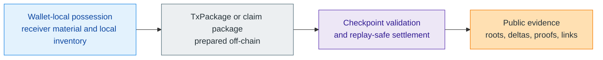

# Docs Home

> [!note]
> **Maturity:** `Live docs hub over current core thesis and bounded target architecture`
>
> **Current posture:** The public site can describe the core thesis, current protocol boundaries, and documented target architecture from the whitepaper corpus. It should not imply that every future service, issuer, or ecosystem surface is already live.

Z00Z is a privacy-first digital cash and settlement architecture built around wallet-local possession and checkpointed public evidence. The shortest honest category sentence is that **Z00Z treats money, rights, and bounded claims as private wallet-local objects first, and only later turns the minimum necessary evidence into public settlement facts**. That is a different starting point from public account chains, which usually treat globally visible balances, addresses, and execution history as the default truth.

This home page exists to make that distinction legible before a reader encounters deeper protocol, developer, or legal material. Z00Z is not presented here as a generic smart-contract platform with privacy features layered on top. It is not a hosted wallet, exchange, or custody desk. It is also not a promise that all of the broader rights economy described in the corpus is already implemented in production. The defensible claim is narrower: the live direction centers confidential asset objects, receiver-native wallet flows, transaction packages, replay-safe checkpoints, and a public layer that acts more like a settlement notary than like a public wallet database.

## In One Sentence

Z00Z is a rights-first settlement model for private cash and related private objects, where wallets carry possession and preparation locally while the public chain verifies only the evidence needed for safe, replay-resistant final settlement.

## Why This Model Exists

The whitepaper corpus starts from a simple observation: public-state blockchains are good at shared verification and bad at preserving cash-like privacy. Once value is organized around reusable accounts and permanent public histories, observers can reconstruct treasuries, payroll cycles, supplier relationships, and personal behavior even if some fields are encrypted. Z00Z responds by narrowing the public surface instead of trying to cosmetically hide an account graph that remains globally legible.

That architectural choice matters for more than payments. If the wallet is already the place where possession, receiver material, and bounded rights are prepared, then the same model can support offline-first cash, externally backed rights, policy-shaped money, or scoped service claims without turning every interaction into a permanent public profile. The corpus describes that broader direction carefully, but it keeps the current claim disciplined: digital cash is the clearest live expression of the model today.

## How The Flow Stays Narrow

The wallet is where ownership, receiver routing, and package preparation begin. The checkpoint boundary is where publication becomes final settlement. The public chain therefore records the state transition evidence, not a full public diary of a user's wallet. That is why Z00Z can talk about privacy and settlement in the same sentence without pretending that privacy means "nothing public ever exists." Public evidence still exists. The design goal is to keep it narrow, typed, and tied to settlement rather than to public account identity.

## What Readers Can Verify Today

| Surface | What the corpus supports now | How to describe it safely |
| --- | --- | --- |
| Core thesis | Wallet-local possession, transaction packages, checkpoint-bound settlement, and narrow public evidence are central throughout the main corpus. | Speak in present tense about the architecture and whitepaper-defined boundaries. |
| Live maturity | Some protocol-facing and verification surfaces are described as live or current, while many ecosystem and expansion layers remain target architecture. | Separate "live core", "active hardening", and "target expansion" explicitly. |
| Legal and service boundary | The legal corpus insists that protocol, steward, wallet, issuer, and service responsibilities remain distinct. | Do not collapse Z00Z into an operator, exchange, custody service, or compliance oracle. |

## Choose A Starting Path

| Start here | Use it when you need | Why it matters |
| --- | --- | --- |
| [Learn](/docs/learn) | A reader-first path into the core ideas, vocabulary, maturity bands, and category boundary. | Best first stop if the corpus feels too large. |
| [Protocol](/docs/protocol) | The detailed settlement, object model, privacy, checkpoint, and architecture model. | Best for technical readers who already understand the high-level thesis. |
| [Developers](/docs/developers) | Workspace, APIs, wallets, storage, runtime services, and verification guidance. | Best for builders deciding whether the repo surfaces match the whitepapers. |
| [Security](/docs/security) | Threat model, crypto-policy, supply-chain, and disclosure discipline. | Best for readers who need the adversary model before they trust the claims. |
| [Legal](/docs/legal) | Public-claim hygiene, steward limits, terms, privacy policy boundaries, and disclosures. | Best for communications, diligence, and partner review. |

## Reading Posture

Use the site as a guided synthesis, not as a replacement for the whitepapers. The docs are meant to get a reader to the right question quickly, explain what can be claimed without exaggeration, and then point back to the primary papers. When a page describes target architecture, it should say so plainly. When a page relies on current implementation evidence, it should keep that evidence narrow and concrete. That is how Z00Z avoids the usual trap of sounding more complete than the repo or corpus can justify.

## Evidence and Further Reading

- `content/whitepapers/Main-Whitepaper.md` sections 1 through 3 define the privacy-first cash thesis, the settlement-notary framing, and the core protocol objects.
- `content/whitepapers/Uniqueness.md` sections 1 through 5 explain why Z00Z is framed as a private spendable rights and settlement layer rather than as a generic privacy coin or public VM.
- `content/whitepapers/Legal-Architecture.md` sections 3, 4, and 17 define the protocol-service boundary, non-claims, and public-communications guardrails that this page follows.
