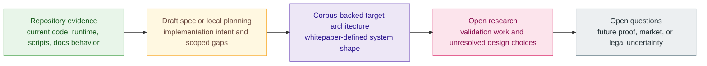

# Live Versus Target Architecture

> [!warning]
> **Use this page when:** You need to know whether a sentence in the docs is
> backed by current repository evidence, by the corpus as target architecture,
> or by open research.

Z00Z has a large architecture and a smaller currently provable repository
surface. That is not a contradiction. It is a maturity fact. The problem begins
when readers, authors, or partners stop distinguishing those layers. A target
architecture statement gets repeated as if it were shipped implementation, and
then the whole project sounds either overstated or internally inconsistent.

This page exists to stop that mistake. It defines the maturity labels used
across the docs and gives examples from protocol, network, security, developers,
and use cases so readers can see how the same discipline applies everywhere.

## The Maturity Ladder

The step that matters most is the jump from repository evidence to target
architecture. A large part of the Z00Z corpus lives on the target-architecture
side of that boundary. That does not make it fiction. It means the docs must
speak carefully.

## The Labels Used Across This Site

| Label | What it means | Safe wording |
| --- | --- | --- |
| Current repository evidence | The current repository proves the surface directly through code, runtime behavior, tests, or docs tooling. | "The current repository shows..." |
| Corpus-backed target architecture | The whitepapers define the intended system shape clearly, but the repository does not yet prove every part. | "The corpus defines..." or "the target architecture describes..." |
| Active hardening | The direction is named and concrete, but validation or migration work is still underway. | "The project has an active hardening path for..." |
| Open research | Important questions are still unresolved or require further validation. | "Open research remains around..." |

These labels are not bureaucracy. They let the docs stay ambitious and honest at
the same time.

## Examples Across The Site

### Protocol

The core object model, wallet-local possession, checkpoints, and settlement
evidence belong close to the live-core and target-architecture boundary. The
main whitepaper treats them as central architecture, and the docs/runtime can
already teach them clearly. Broader object families or future disclosure lanes
should still be described as target architecture unless repo evidence supports a
narrower claim.

### Network

Publication, validation roles, checkpoint anchoring, and watcher evidence are
named explicitly in the corpus. Some of the website and docs runtime can explain
those roles today, but the full operator and service stack is wider than the
current repository proof surface. Network pages should therefore separate the
pipeline concept from the maturity of each implementation surface.

### Security

The privacy threat model, public-claim guard rails, and post-quantum migration
language are especially sensitive to maturity drift. Security pages should
almost never sound casual about completion. "Current cryptographic boundary,"
"active migration path," and "privacy budget" are more honest and more useful
than blanket claims such as "fully anonymous" or "post-quantum ready."

### Developers

Developer docs must be even stricter because they point into local code and
tools. When a developer page references the repository, it should narrow its
claims to what the current workspace actually shows: runtime structure, content
loader behavior, verification scripts, or other concrete anchors. It can still
explain the target architecture, but it must not quietly promote whitepaper
scope into present-tense implementation fact.

### Use Cases

Use-case docs are where maturity confusion often becomes strongest. The white
papers describe a rich set of scenarios, including private cash, rights over
external assets, policy-shaped money, organizational settlement, and agent
rights. Those are real architectural directions, but they do not all belong to
the same current evidence band. Use-case pages should teach the scenario while
keeping the maturity boundary visible.

## Why This Distinction Protects Readers

Builders need to know whether a repo surface actually exists before they design
against it. Researchers need to know whether they are reading a theorem, a
design claim, or a research agenda. Partners need to know whether a described
lane is already operational or still conditional on future validation. Legal and
communications reviewers need the distinction because public claims can become
unsafe when target architecture is stated as if it were shipped product.

The distinction also protects the project itself. A docs site that admits the
difference between current evidence and target architecture is easier to trust
than one that tries to make every sentence sound equally complete.

## How To Read A Page With This In Mind

When you read a Z00Z page, ask:

1. Which part of the statement is directly supported by current repo evidence?
2. Which part is justified by the corpus as intended system design?
3. Which part is still a hardening or research lane rather than a stable claim?

If the page cannot answer those three questions, it is not yet written tightly
enough.

## Common Reading Errors

The most common error is to confuse a detailed whitepaper description with a
shipped implementation claim. Detail is not the same thing as maturity. The
second common error is to assume that because a concept appears in the current
repository or docs, the entire companion architecture around that concept is
already proven. The third common error is to treat hardening work such as
privacy metrics or post-quantum migration as either finished or fictional, with
no middle state. In reality, active hardening is its own important category.

These mistakes do not only affect marketing language. They also distort design
review, partner diligence, and developer planning. A builder who mistakes target
architecture for current repo evidence can design against the wrong boundary. A
reviewer who mistakes active hardening for pure aspiration can miss the real
progress already encoded in the corpus.

## How Authors Should Label Evidence

Good docs writing makes the source of confidence visible. If a claim is repo
backed, name the repo surface. If it is corpus backed, name the paper and
section. If it is still research, say so plainly. This is one reason every
public docs page in Phase 002 ends with evidence anchors and a next step. The
footer is part of the maturity contract, not a decorative appendix.

## Why The Docs Repeat Maturity Labels

The maturity labels are intentionally repetitive because readers arrive on pages
out of order. A person may land on a use-case, security, or developer page
directly from search or a shared link. Repeating the labels keeps the docs
self-correcting. It prevents one isolated page from sounding more final than the
rest of the corpus can support.

It also creates a review habit. When the label is missing, reviewers can ask why
the maturity source is unclear. That keeps the documentation aligned with the
same evidence discipline the architecture expects from the system itself.

It also gives outside readers a fairer way to judge progress. Instead of asking
whether the entire vision is finished, they can ask which band a claim belongs
to and what evidence justifies that band.
That makes disagreement more precise and more useful.
It also makes honest progress easier to see.
Precision improves trust over time.

## Read Next

- Read [Roadmap](/docs/learn/roadmap) if you want the same maturity discipline
  organized as development sequence and evidence gates.
- Read [Main Whitepaper](/docs/learn/main-whitepaper) if you want to see where
  section 12 makes this split explicit.
- Read [Security](/docs/security) if you need the most caution-heavy examples of
  claim hygiene.

## Evidence and Further Reading

- `content/whitepapers/Main-Whitepaper.md` section 12 is the primary source for
  the live-versus-target split used throughout this page.
- `content/whitepapers/DAO.md` section 11 shows how rollout sequence and
  governance maturity can be described without pretending full implementation.
- `content/whitepapers/Post-Quantum-Migration.md` section 13 is the canonical
  example of a roadmap lane with explicit evidence gates and communication
  discipline.
- `content/whitepapers/Privacy-Threat-Model.md` section 11 shows where open
  questions remain visible instead of being hidden behind false certainty.
