# Private Objects

> [!note]
> **Use this page when:** You understand the one-sentence definition of Z00Z and
> now need the concrete mental model behind it.

The phrase "private object" is one of the most important ideas in the Z00Z
docs. It sounds abstract until you see what problem it solves. Most blockchain
systems start by treating public state as the default truth and then ask how to
hide pieces of it. Z00Z starts by treating value, requests, rights, and
supporting evidence as things a wallet can hold and prepare locally before the
public layer needs to know about them.

That is why the docs do not talk only about balances. A balance is a useful
summary after settlement, but it is a poor beginner model for a system that is
trying to separate possession, transfer preparation, settlement, and optional
disclosure. Private objects make those stages visible.

## What Counts As A Private Object

In the current corpus, you can think about five beginner-level examples:

- **Asset objects** for clean final value.
- **Right objects** for bounded authority without direct value.
- **Voucher objects** for conditional value that is meaningful without being the
  same thing as final cash.
- **Payment request objects** for receiver-led acceptance conditions and wallet
  safety.
- **Evidence objects** for proving, auditing, or challenging what happened
  without turning the whole wallet state into a public transcript.

These examples matter because they show that Z00Z is not only trying to hide a
coin transfer. It is trying to define a wider grammar for private digital
possession and later settlement.

## Why The Object Model Changes The Category

When a wallet holds a private object, it is not merely caching a future public
account change. It is holding the material that defines what can be transferred,
what conditions apply, what receiver context matters, and what evidence may
later need to be shown. That pushes real meaning into the wallet layer.

The result is a different first question. In a public account system, the first
question is often "what does the global state say right now?" In Z00Z, the first
question is closer to "what does the wallet currently possess, what can it
prepare safely, and what must become public only if settlement is required?"

## Account State, Shielded Pool State, And Private Object State

| Model | Default truth location | What moves first | What becomes public | What the user is really holding |
| --- | --- | --- | --- | --- |
| Public account state | Shared ledger | An account balance change | Much of the state and address history | Access to a public account relationship |
| Shielded pool state | Public chain with hidden internals | A shielded transfer inside a shared pool | A public chain event with stronger hiding | Membership in a private transfer system |
| Z00Z private object state | Wallet-local possession plus later settlement | A private object package prepared locally | Narrow checkpointed evidence | Possession of a typed object that can later be settled |

This table is not meant to insult other designs. It is meant to show why Z00Z
keeps insisting on the object metaphor. The system wants the user to think in
terms of held objects and bounded publication, not only in terms of balances.

## Lifecycle From Local Possession To Evidence

```mermaid
flowchart LR
  Create["Object creation<br/>asset, right, voucher, request"] --> Hold["Local possession<br/>wallet inventory and policy checks"]
  Hold --> Transfer["Local transfer or acceptance prep<br/>receiver material and package assembly"]
  Transfer --> Publish["Publication<br/>candidate artifacts become visible"]
  Publish --> Checkpoint["Checkpoint<br/>settlement becomes final"]
  Checkpoint --> Evidence["Evidence readout<br/>receipts, proofs, references"]

  style Create fill:#E8F5E9,stroke:#43A047,stroke-width:1px,color:#1B5E20
  style Hold fill:#E3F2FD,stroke:#1E88E5,stroke-width:1px,color:#0D47A1
  style Transfer fill:#FFF8E1,stroke:#F9A825,stroke-width:1px,color:#6D4C41
  style Publish fill:#ECEFF1,stroke:#546E7A,stroke-width:1px,color:#263238
  style Checkpoint fill:#EDE7F6,stroke:#5E35B1,stroke-width:1px,color:#311B92
  style Evidence fill:#FFE0B2,stroke:#F57C00,stroke-width:1px,color:#263238
```

The critical distinction is that publication happens after meaningful local
state has already existed. The public layer does not invent the object from
nothing. It verifies and settles a bounded transition involving an object that
was already being held, routed, or constrained in the wallet layer.

## Assets, Rights, Vouchers, Requests, And Evidence

Assets are the simplest starting point because they map to value most directly.
The asset object is what lets Z00Z talk about cash while still refusing to make
the public account graph the default truth surface.

Rights matter because many real systems need authority without pretending that
every authority is value. A right can grant action, delegation, or bounded
control while still staying conceptually different from cash.

Vouchers matter because conditional value is not the same as dirty or broken
cash. The assets, rights, and vouchers paper spends real effort separating them
so the system can support richer economic flows without pretending all value has
identical guarantees.

Payment requests matter because the receiver is not just an address. The
receiver is part of the acceptance boundary. A request can express what kind of
object is expected, what safety rules should apply, and what a wallet should
quarantine or refuse.

Evidence matters because private systems still need shared proof surfaces.
Evidence objects let Z00Z explain how claims, receipts, and challenge material
can exist without turning the protocol into a public diary.

## Live Evidence Versus Target Architecture

The object model appears across the current corpus as a core architectural idea,
but not every future object family should be described as equally mature. The
strongest current reading is that private objects are the right mental model for
understanding Z00Z, and that assets, rights, vouchers, requests, and evidence
form the teaching surface for that model. The wider family of object types and
service overlays remains target architecture and should stay labeled that way.

## How Private Objects Change Wallet Responsibility

The object model also changes what a wallet is responsible for. In a public
account world, a wallet can look like a convenience layer over shared state. In
the Z00Z model, the wallet is closer to a safety boundary. It carries possession
material, evaluates receiver context, shapes package creation, applies local
policy, and may later decide how evidence or disclosure packages are handled.

That does not make the wallet identical to the protocol. It means the protocol
and the wallet have different jobs, and the docs should describe both carefully.
Once a reader understands that distinction, later pages about receiver flow,
liability, selective disclosure, or developer APIs become much easier to read
without confusion.

## Why Not Just Call Them Balances

"Balance" is a useful result after settlement, but it is a weak teaching model
before settlement. It hides the distinction between value, authority, request
state, conditions, and evidence. Private objects keep those meanings separate
long enough for the reader to see why Z00Z can support richer flows without
pretending every object has the same guarantees or the same public footprint.

That separation is also what makes later policy, refund, audit, or rights
stories readable. Without it, every advanced page would sound like a special
case bolted onto one generic payment metaphor.
The object language keeps those later distinctions honest from the start.

## Why Readers Should Care

This page is not only for protocol readers. Builders need it because APIs and
wallet flows make less sense when everything is translated into public-account
terms. Researchers need it because comparison arguments depend on what is being
compared. Legal reviewers need it because responsibility attaches differently
when a system is built around wallet-local possession and optional service
layers. Users need it because the wallet becomes a safety boundary, not merely a
dashboard.

## Read Next

- Read [Live Versus Target Architecture](/docs/learn/live-vs-target) next so
  you can separate core object claims from future object-family expansion.
- Read [Main Whitepaper](/docs/learn/main-whitepaper) if you want the full
  protocol context for the lifecycle shown above.
- Jump into [Protocol](/docs/protocol) when you want deeper settlement and
  object-family detail.

## Evidence and Further Reading

- `content/whitepapers/Main-Whitepaper.md` sections 2 through 5 define the
  private-object thesis, canonical state objects, checkpoints, and wallet-local
  possession model summarized here.
- `content/whitepapers/Uniqueness.md` sections 2 through 5 explain why private
  rights transfer and wallet-local possession change the system category.
- `content/whitepapers/Assets-Rights-Vauchers.md` sections 3 through 6 define
  the asset, voucher, and right split used by this page.
- `content/whitepapers/Corpus-Terminology-Reference.md` section 3 provides the
  shared object vocabulary that keeps these explanations consistent.
