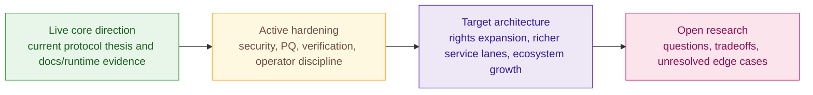

# Roadmap

> [!note]
> **Reading rule:** This page is about sequence and evidence gates, not launch
> theater. Use it to understand what can be claimed now, what still needs
> hardening, and what remains target architecture.

Z00Z has a wide architecture, but it should not be described as if every named
lane belongs to the same maturity band. The docs need a roadmap because the
corpus itself distinguishes between core direction, hardening work, and future
expansion. Without that distinction, good architecture starts sounding like bad
marketing.

The roadmap here is therefore maturity-first rather than date-first. It tells
you what kinds of things must become true before a family can be described as
live, and it keeps the reader anchored to evidence rather than to aspirational
calendar promises.

## The Maturity Ladder

The important point is that movement up this ladder is not a marketing choice.
It is an evidence choice. A surface moves forward when the corpus and the
repository together justify stronger wording.

## What Belongs In The Live Core Story

The current live-core story is already strong. The corpus consistently supports
these claims:

- Z00Z is organized around wallet-local possession, portable packages, and
  checkpoint-bound settlement evidence.
- Privacy is structural to the object and settlement model rather than an addon
  over public accounts.
- The public layer is meant to remember narrow settlement evidence, not a
  permanent social graph of addresses and balances.
- Protocol, wallet, issuer, steward, and service responsibilities stay
  separated.

These are architecture claims, not release-note claims. They are safe because
they are repeated as core design commitments in the main paper and companion
papers.

## What Counts As Active Hardening

Some work is specific enough to be more than a dream but not mature enough to be
described as done. Post-quantum migration is the clearest example. The
dedicated migration paper is explicit that Z00Z is not fully post-quantum secure
today, but it also explains why parts of the settlement and storage boundary are
comparatively migration-friendly. That is exactly how active hardening should be
described: real direction, clear reason, incomplete evidence.

The same posture applies to privacy metrics, operator tooling, more mature
disclosure profiles, and deeper verification surfaces. These are important, but
they are not helped by pretending the validation burden has already vanished.

## What Remains Target Architecture

Target architecture includes the wider rights economy, richer external-asset
flows, expanded compliance overlays, mature machine or agent rights, and larger
ecosystem lanes that build on the same object and checkpoint model. The
whitepapers can and should describe those paths. What the docs must not do is
turn those paths into a flat promise that all later layers are already present.

Readers should see target architecture as the intended direction of the system,
not as a hidden admission of vapor. The honest test is simple: can a current doc
point to repository evidence or to a stronger corpus implementation claim? If
not, the language should stay future-facing.

## Why Dates Are The Wrong First Question

Roadmaps often fail because they answer "when" before they answer "what must be
true." That is especially dangerous for a system like Z00Z, where privacy,
settlement, responsibility boundaries, governance, and cryptographic migration
all interact. A date can be useful later. It is not the first thing a serious
reader should trust.

The stronger question is whether the dependency chain is visible. Has the object
model stabilized? Are the legal and public-claim boundaries explicit? Has the
privacy threat model been tightened? Are verification and migration gates named?
If those answers are vague, then a calendar promise does not add safety. It only
adds pressure to overstate maturity.

## What Must Be True Before This Is Live

| Family | Minimum truth before stronger live language |
| --- | --- |
| Core protocol | Stable object definitions, checkpoint rules, and evidence boundaries that are consistent across docs and code-facing surfaces. |
| Privacy and security | Threat model coverage, explicit non-claims, privacy-budget language, and verification or testing that supports the wording. |
| Post-quantum migration | Named suites, migration gates, communication discipline, and proof that old and new boundaries are not being mixed carelessly. |
| Governance and tokenomics | Rule-bound descriptions of treasury, voting, and incentives that do not imply discretionary control or live-market facts without evidence. |
| External assets and service overlays | Clear issuer or operator separation, trust-tier language, and visible boundaries for what the core protocol does not guarantee. |

This checklist is more useful than dates because it shows readers the actual
dependency structure. A protocol does not become live because a roadmap says so.
It becomes live because the required truth surfaces become demonstrably true.

## Reading Sequence Across Major Families

The roadmap also implies an order of understanding. The private-object and
checkpoint model needs to be legible before later rights or asset families make
sense. Security and privacy gates need to be visible before stronger public
claims are made. Governance and tokenomics need rule-bound language before they
can be presented as durable public systems. Ecosystem or agentic lanes need
clear protocol and legal boundaries before they become persuasive rather than
speculative.

In other words, the roadmap is not only about implementation. It is about which
truths need to become stable before later truths can be explained safely.

## How Roadmap Language Should Appear On Public Pages

Public pages should pair architecture with maturity. Instead of saying "Z00Z
will do everything from private cash to agent rights," they should say which
part of that sentence is core direction, which part is hardening, and which part
is target architecture. That style is slower, but it gives readers something
more valuable than hype: a believable progression.

It also makes cross-team communication healthier. Writers, builders, reviewers,
and partners can all point to the same maturity frame instead of improvising
their own.

That shared frame matters because it prevents roadmap language from changing
meaning depending on who is speaking.
It also makes later milestones easier to audit against real evidence.
Without that discipline, ambitious architecture easily becomes vague promise.
The roadmap is strongest when it names gates, not hype.
That keeps progress legible and falsifiable.
Readers deserve that level of clarity.

## Safe Language For Progress

If you need one sentence that sounds both ambitious and honest, combine the
architecture and the maturity level in the same breath.

- "The current corpus defines Z00Z as a wallet-local, checkpointed private cash
  and settlement model."
- "Broader rights and service lanes are intentional target architecture, not a
  blanket live-product claim."
- "Post-quantum migration is an active hardening track with explicit evidence
  gates."

Avoid sentences that imply inevitability, dates, or launch certainty unless the
source actually provides them. The roadmap should narrow hype, not widen it.

## How Readers Should Use This Page

Builders can use it to keep implementation talk narrower than the architecture.
Partners can use it to understand which claims are safe in diligence or public
materials. Reviewers can use it to challenge any page that silently upgrades a
target lane into present tense. New readers can use it to avoid the common trap
of confusing the size of the vision with the maturity of each subsystem.

## Read Next

- Read [Live Versus Target Architecture](/docs/learn/live-vs-target) if you
  want the maturity labels explained with concrete examples.
- Read [Comparisons](/docs/learn/comparisons) if you need public language that
  stays accurate while comparing Z00Z to other systems.
- Read [Legal](/docs/legal) if you need the public-claim boundary in formal
  terms.

## Evidence and Further Reading

- `content/whitepapers/Main-Whitepaper.md` section 12 is the primary source for
  the split between what is already live, what remains target architecture, and
  what expansion path is being proposed.
- `content/whitepapers/Post-Quantum-Migration.md` sections 8, 12, and 13 define
  the migration path, communication discipline, and evidence gates for an active
  hardening example.
- `content/whitepapers/DAO.md` section 11 and `content/whitepapers/Tokenomics.md`
  section 10 support the claim that governance and incentive lanes need phased,
  maturity-aware language rather than flat production claims.
