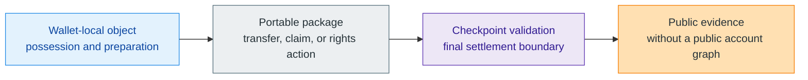

# What Is Z00Z?

> [!note]
> **One-sentence answer:** Z00Z is a private-object and checkpointed settlement
> system in which wallets hold possession locally and the public layer records
> only the evidence required for final settlement.

That sentence is compact, but each part matters.

It says **private-object** because the system is not organized around a default
public account graph. It says **checkpointed settlement** because publication is
not enough on its own; the architecture cares about replay-safe finality and
typed state transitions. It says **wallets hold possession locally** because
control starts in the wallet, not in a public balance table. And it says **only
the evidence required** because privacy here does not mean "nothing public ever
exists." It means the public surface is narrowed to the artifacts needed for
shared verification.

That category sentence matters because readers usually make one of two mistakes.
They either shrink Z00Z into a privacy coin, or they expand it into a generic
private smart-contract chain. Both moves miss the core thesis. Z00Z is trying
to change where value and rights live before settlement, what the chain must
remember afterward, and how optional service or disclosure layers sit above the
core without becoming the core itself.

## The Fast Mental Model

The wallet carries private objects, receiver material, and local decision logic.
The package carries the bounded proof material for a transfer or claim. The
checkpoint decides whether that bounded evidence becomes final settlement. The
record becomes public only at the level required for shared verification. Once
you see the system this way, "privacy" and "verifiability" stop looking like
opposites. They are two constraints that are being satisfied at different
layers.

## The Objects, The Possession, And The Settlement

The easiest way to understand Z00Z is to split the system into three truths.

The first truth is that value and rights are held locally before settlement.
This is why the docs talk about assets, vouchers, rights, payment requests, and
evidence objects rather than only about balances. A wallet is not just a window
into public state. It is the place where possession and transfer preparation are
actually assembled.

The second truth is that not every local action becomes final settlement. A
transfer package can be prepared, exchanged, validated, rejected, retried, or
queued before it crosses a checkpoint. Publication matters, but the public layer
does not get to define possession by itself. Checkpoints exist because the
system needs a clear moment where replay risk, ordering, and settlement truth
become publicly shareable.

The third truth is that evidence is public for a reason. Z00Z does not promise a
world with no public artifacts. It promises a world where the public artifacts
are narrower, more typed, and more settlement-focused than a public account
history would be. That distinction is why the docs keep using phrases such as
"settlement evidence," "checkpoint boundary," and "wallet-local possession."

## What Z00Z Is

| Statement | Why it is accurate |
| --- | --- |
| Z00Z is a private-object and settlement architecture. | The corpus centers wallet-local objects, packages, checkpoints, and evidence rather than reusable public accounts. |
| Z00Z is privacy-first without denying public verification. | The system narrows what becomes public instead of pretending final settlement can happen with no public evidence at all. |
| Z00Z is rights-capable, not only coin-capable. | Companion papers extend the model from private cash into vouchers, rights, and external-asset lanes. |
| Z00Z separates protocol guarantees from service overlays. | Wallets, issuers, auditors, bridges, and stewards may exist, but they should not be confused with the protocol core. |

## What Z00Z Is Not

| Misleading label | Why it fails |
| --- | --- |
| A hosted wallet | The architecture separates protocol from operator or wallet-service responsibilities. |
| A universal hidden VM | The corpus does not claim generic hidden public-state programmability as the primary story. |
| An official DEX | External trading or bridge layers are distinct roles with their own trust and legal boundaries. |
| An anonymous compliance bypass | Selective disclosure, liability, and legal boundary papers explicitly reject that framing. |
| A public account chain with private balances | The design goal is to move the default truth boundary away from public account state entirely. |

These non-examples are not rhetorical attacks on other systems. They are guard
rails for accurate reading. Once you place Z00Z in the wrong category, every
later description starts to sound either overhyped or internally contradictory.

## Why The Category Boundary Matters

If you describe Z00Z as "a privacy chain," most readers will assume an ordinary
coin or account model with improved hiding. If you describe it as "a rollup,"
they will assume the interesting part is batching and scaling. If you describe
it as "offline e-cash," they may miss the checkpoint and evidence layer. Each
comparison captures something real, but none of them is sufficient on its own.

The better first question is simpler: what must the public layer remember? In a
public account system, the answer usually includes addresses, balances, and
shared execution history. In Z00Z, the answer is narrower: roots, deltas,
proofs, checkpoint references, and evidence that a bounded transition became
valid settlement. That changes what privacy means, what legal language should
avoid, what a wallet is responsible for, and what future service layers are
allowed to know.

## Live Evidence Versus Wider Ambition

The corpus deliberately connects private cash to a larger rights-oriented future,
but it does not give readers permission to flatten those layers together. The
strongest present-tense claim is that Z00Z is organized around private objects,
wallet-local possession, checkpointed settlement, and narrow public evidence.
The broader rights economy is real in the papers, but it remains a target
architecture path that must be discussed with maturity discipline.

That is why this page is intentionally plain. It gives you the strongest safe
answer first and lets later pages add the richer architecture only after the
reader has a stable base.

## Why Receiver Flows And Evidence Matter So Early

One reason the category question matters is that it changes how you think about
receivers. In a public account system, the receiver is often just an address. In
the Z00Z model, the receiver is part of an acceptance boundary. A request can
shape what kind of object is acceptable, how the wallet should treat policy or
refund conditions, and what should be quarantined instead of silently accepted.

Evidence matters for the same reason. If Z00Z were only a hidden wallet graph,
then public evidence would look like a compromise. In the corpus, evidence is a
necessary part of the settlement story. It is how the system stays verifiable
without turning all private possession into a permanent public social graph.
Understanding that tradeoff early makes the rest of the docs much easier to
trust.

## What This Means For Public Claims

Once you understand the category correctly, the safe public language becomes
clearer too. You can say that Z00Z is organized around private objects and
checkpointed settlement. You should be cautious about saying that it is
"anonymous," "untraceable," or a finished universal rights platform. The right
definition makes honest claims easier and misleading claims harder.

## Read Next

- Read [Private Objects](/docs/learn/private-objects) next if you want to turn
  the category sentence into a concrete object model.
- Read [Main Whitepaper](/docs/learn/main-whitepaper) if you want the section
  map behind the summary on this page.
- Read [Terminology](/docs/learn/terminology) before protocol pages if terms
  such as checkpoint, voucher, or settlement evidence still feel unstable.

## Evidence and Further Reading

- `content/whitepapers/Main-Whitepaper.md` sections 1 through 6 define the
  protocol thesis, canonical object model, checkpoint boundary, offline
  ownership, and privacy/disclosure posture summarized here.
- `content/whitepapers/Uniqueness.md` sections 2 through 5 explain why Z00Z
  should not be reduced to privacy coins, public-account chains, or lighter
  account-abstraction narratives.
- `content/whitepapers/UseCases.md` sections 2 and 3 show how the same category
  statement scales from private cash into broader rights and policy-shaped
  objects without changing the core model.
