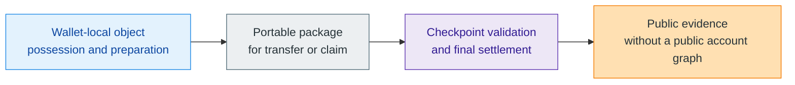

# What Is Z00Z?

> [!note]
> **Maturity:** `Site support`
>
> **Use this page when:** You want the shortest answer that is still defensible against the current corpus.

Z00Z is a privacy-first digital cash and settlement model in which wallets hold and prepare private objects locally, while the public chain records only the evidence needed to prove that a transition was authorized, replay safe, and checkpoint-valid. That answer matters because it prevents a reader from placing Z00Z in the wrong category too early. If you mistake it for a public account chain, a privacy coin with account semantics, or a hosted wallet service, the rest of the corpus becomes harder to read correctly.

The current corpus keeps returning to the same design choice: **public state should be narrow settlement evidence, not a public social graph of balances and addresses**. Wallet-local possession, receiver-native flows, and transaction packages exist to keep control local until publication is actually needed. Checkpoints exist to make the public transition final and replay safe. The result is a system that starts from private spendable objects and later publishes the minimum durable facts required for settlement.

## A One-Page Mental Model

The wallet carries possession logic, receiver material, and local preparation. The package carries the bounded evidence needed for a candidate transfer. The checkpoint boundary is where the chain decides whether that evidence becomes final settlement. That is why Z00Z talks about privacy and verifiability together rather than treating them as opposites.

## What Z00Z Is And Is Not

| Z00Z is... | Z00Z is not... |
| --- | --- |
| A rights-first settlement model for private cash and related private objects. | A promise that everything in the wider rights economy is live today. |
| A wallet-local possession system that delays public evidence until settlement is required. | A public account ledger with privacy paint added afterward. |
| A checkpointed evidence model with explicit replay boundaries. | A hosted wallet, exchange, issuer, or official custody layer. |
| A protocol that separates core settlement guarantees from optional service overlays. | A license to make unlimited "anonymous", "untraceable", or "regulation-proof" claims. |

## Why The Category Boundary Matters

Most blockchain readers are trained to ask the wrong first question: "Which chain is this most like?" The corpus suggests a better question: "What does the public layer have to remember?" In public account chains, the answer is usually addresses, balances, and shared state. In Z00Z, the answer is much narrower: roots, deltas, proofs, canonical links, and checkpoint evidence. That difference changes how privacy, offline behavior, service boundaries, and even legal claims should be understood.

It also explains why the whitepapers connect digital cash to a broader rights-oriented direction without collapsing the two into one vague promise. Digital cash is the clearest live wedge. The broader rights story is an extension path, not a shortcut that lets the site skip maturity discipline.

## Read Next

If this page feels right but still abstract, move next to [Main Whitepaper](/docs/learn/main-whitepaper). That page shows which sections of the core paper support the thesis you just read and where to go when you need deeper detail. If the vocabulary still feels unfamiliar, jump to [Terminology And Abbreviations](/docs/learn/terminology) before you read protocol pages.

## Evidence and Further Reading

- `content/whitepapers/Main-Whitepaper.md` sections 1, 2, 3, and 5 define the privacy-first cash thesis, checkpoint-bound settlement, canonical objects, and offline-first wallet posture used on this page.
- `content/whitepapers/Uniqueness.md` sections 1 through 5 explain the shift from public accounts to private spendable rights, service separation, and fee-bound portable rights.
- `content/whitepapers/UseCases.md` sections 2 and 3 show how the same architecture scales from private cash into broader rights and policy-shaped objects without changing the core category claim.
