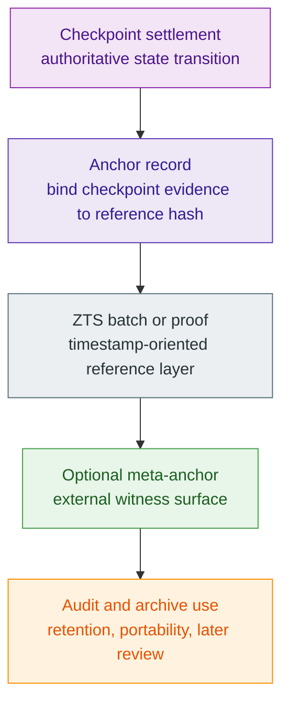

# Checkpoint Anchors And ZTS

> [!warning]
> **Maturity:** `Target supportive proof layer`
>
> **Use this page when:** You need to explain how anchors and timestamps support verification without replacing the checkpoint settlement boundary.

Anchors and timestamp services are useful because they make public evidence easier to retain, reference, and verify across time and across systems. They can help auditors, enterprise teams, public tooling, and long-lived archives. They are also dangerous to describe carelessly. If a page says "the anchor proves the settlement," readers will confuse a proof reference with the protocol truth it points toward. Z00Z needs a sharper line: **anchors and ZTS strengthen verifiability around settlement; they do not substitute for settlement**.

If you need the underlying settlement boundary first, read [Protocol Checkpoints](/docs/protocol/checkpoints). This page assumes that checkpoint truth already exists and asks how supporting proof layers can point back to it responsibly.

## Authority Layers

The order above is intentional. Checkpoint settlement comes first because it is the authoritative state transition. Anchor records can bind that evidence to a referenceable hash. ZTS can batch or timestamp those references. A meta-anchor can pin the reference externally. Archives and auditors can rely on these layers later. But none of the later layers gain the power to define whether the original settlement was valid.

## What Each Layer Is Good For

| Layer | Useful for | Not sufficient for |
| --- | --- | --- |
| Checkpoint | Final authoritative settlement progression | Off-chain archival convenience by itself |
| Anchor | Stable reference binding between a checkpoint fact and a hash | Proving the underlying business claim alone |
| ZTS | Timestamped inclusion or batch reference | Replacing the settlement theorem |
| Meta-anchor | External witness or additional retention surface | Turning another network into Z00Z authority |

This table is the core of the page. Every later example should preserve it.

## Why Anchors Help

Used correctly, anchors and timestamps improve several workflows:

| Workflow | Why a supportive proof layer helps |
| --- | --- |
| Audit retention | Reviewers can keep a compact pointer to public evidence |
| External verification packages | Another system can check that a referenced fact existed at or before a time |
| Long-horizon archives | Evidence can stay portable without storing every surrounding system assumption inline |
| Cross-system attestations | Supporting references can travel farther than raw operator memory |

These are strong benefits. They remain supportive rather than sovereign.

## Common Anchor Overclaims

| Overclaim | Better wording |
| --- | --- |
| "The timestamp proves the transfer was valid." | "The timestamp proves a referenced artifact was included or batched at a certain time." |
| "The meta-anchor makes another network the authority." | "The meta-anchor is an external witness, not a settlement replacement." |
| "An archive bundle can stand alone without checkpoint semantics." | "Archive bundles still depend on the authoritative checkpoint interpretation they reference." |
| "Public referenceability equals public business transparency." | "Reference layers can support audits without revealing the full private meaning of a transaction." |

This is exactly where legal, audit, and operator language can drift if the docs are not strict.

## Current Repo Posture

This repository does not claim to ship a full ZTS or anchor service implementation. It does support the explanation with local evidence:

| Source | Why it helps |
| --- | --- |
| `content/whitepapers/Main-Whitepaper.md` | Defines checkpoints and settlement evidence as the primary authority layer |
| `content/whitepapers/Cross-Chain-Integration.md` | Helps frame supporting attestations and external witness layers |
| `content/whitepapers/Corpus-Terminology-Reference.md` | Standardizes `Anchor`, `ZTS`, `Anchor calendar`, and `Meta-anchor` |
| `content/docs/protocol/checkpoints.md` | Gives the exact companion page for the authoritative settlement boundary |

That is the right scope for a docs repo. It keeps enterprise and operator narratives accurate before implementation specifics arrive.

## Read Next

Continue to [Node Operations](/docs/network/node-operations) if your next question is how an operator would reason about these layers in practice, or move to [Status And Explorer](/docs/network/status-explorer) if the next concern is what public tooling should show about anchors safely.

## Evidence and Further Reading

- `content/whitepapers/Main-Whitepaper.md` defines checkpoints and settlement evidence as the authoritative layer to which anchors must remain subordinate.
- `content/whitepapers/Cross-Chain-Integration.md` provides the right service-boundary framing for attestations, external witnesses, and supportive proof layers.
- `content/whitepapers/Corpus-Terminology-Reference.md` standardizes `Anchor`, `ZTS`, `Anchor calendar`, and `Meta-anchor`.
- `content/docs/protocol/checkpoints.md` is the current repo-local page that explains the settlement boundary this page must not overstate.
