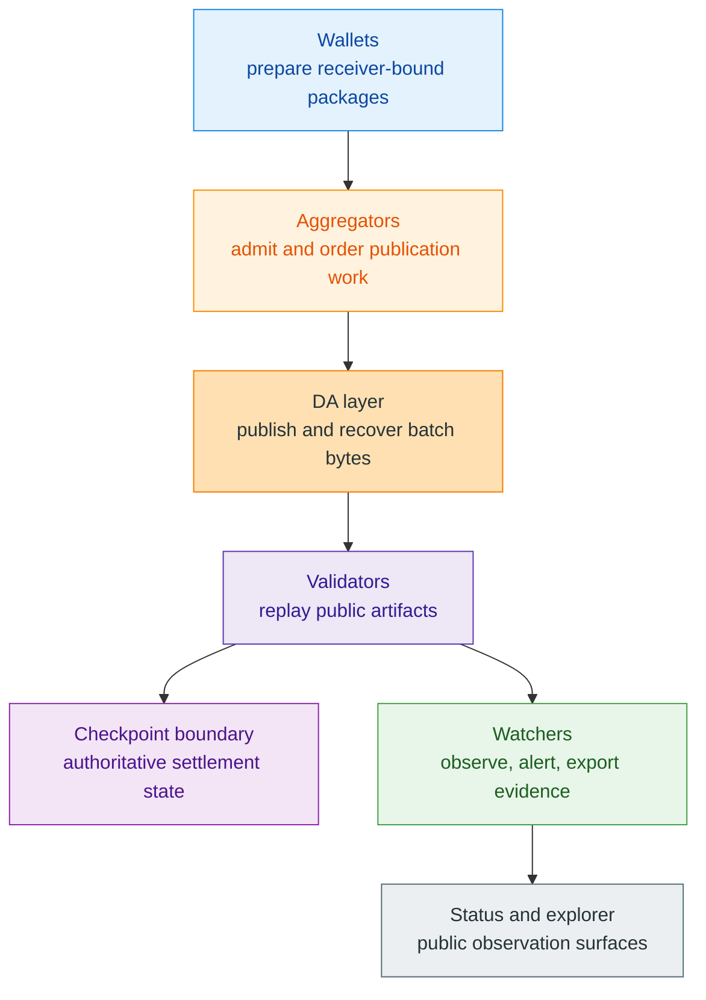

# Network

> [!warning]
> **Maturity:** `In-progress operator family + current docs evidence`
>
> **Use this page when:** You need the operator map before reading role-specific pages on aggregators, validators, watchers, data layers, privacy ingress, or public status.

The network family exists to answer one question cleanly: **how does work move from wallet-local preparation to public settlement evidence without letting every service layer pretend to be the source of truth?** Z00Z needs this answer because it is deliberately not a public-account chain where all meaning begins and ends inside one globally inspectable runtime. Wallets prepare packages locally. Operators and services move those packages toward publication. Validators replay public artifacts. Watchers observe. Data-availability layers preserve bytes. Anchors and timestamps can prove that a public artifact existed at a certain moment. But settlement authority remains narrower than all of those surfaces combined.

This page is a hub, not a promise that every network component is already fully deployed in this repository. The current repo proves the docs surface, the whitepaper corpus, and the vocabulary that later operator work must preserve. It does not prove that every future network service is already running.

## System Map

The order above is a responsibility chain, not an authority ladder. Aggregators can order work without defining validity. DA can preserve bytes without deciding finality. Watchers can export evidence without becoming settlement judges. Even public status pages should report what happened without pretending they are the theorem that made it true.

## Operator Reading Order

Use this section according to the role you actually hold:

| If you are... | Read first | Then continue with |
| --- | --- | --- |
| A new operator or reviewer | [Network Overview](/docs/network/overview) | [Aggregators](/docs/network/aggregators), [Validators](/docs/network/validators), [Watchers](/docs/network/watchers) |
| Focused on publication or ingestion | [Aggregators](/docs/network/aggregators) | [Data Availability](/docs/network/data-availability), [Node Operations](/docs/network/node-operations) |
| Focused on correctness and dispute surfaces | [Validators](/docs/network/validators) | [Checkpoint Anchors And ZTS](/docs/network/checkpoint-anchors-zts), [Status And Explorer](/docs/network/status-explorer) |
| Focused on privacy and ingress | [OnionNet](/docs/network/onionnet) | [Watchers](/docs/network/watchers), [Data Infrastructure](/docs/network/data-infrastructure) |
| Building public tooling or analytics | [Data Infrastructure](/docs/network/data-infrastructure) | [Status And Explorer](/docs/network/status-explorer) |

This reading order matters because Z00Z uses one vocabulary across multiple operator surfaces. If every page introduces its own version of "network truth," the family stops being useful.

## The Core Separation To Preserve

Every page in this family should keep the following split visible:

| Layer | What it does | What it must not claim |
| --- | --- | --- |
| Wallet | Holds private possession, receiver material, and package preparation | Canonical finality by itself |
| Operator runtime | Moves, checks, publishes, and observes work | Ownership meaning or universal public-state semantics |
| DA and anchor services | Preserve bytes, receipts, timestamps, or references | Settlement validity on their own |
| Explorer and status tools | Summarize public state and operator health | The full privacy story or authoritative business truth |

This is why the network family belongs next to protocol and developer docs rather than inside a generic infrastructure guide. The network story is part of the protocol story. It simply lives on a different authority plane.

## Current Versus Target Surfaces

Readers should expect a mix of maturity levels here.

| Surface | Current posture |
| --- | --- |
| Role boundaries for aggregators, validators, watchers, DA, and anchors | Real and corpus-backed now |
| Full operator closure, deployment ergonomics, and public explorer implementation | Still broader target work |
| Privacy-ingress and OnionNet transport discipline | Conceptually defined, not something this repo claims to ship fully today |
| Docs-level navigation and evidence trails | Live and verifiable in this repository |

That is the honest posture for this phase: the explanations are real, the current repo is real, and the broader operator stack is still maturing.

## Page Set

| Page | Why it exists |
| --- | --- |
| [Network Overview](/docs/network/overview) | Gives the shortest role map before detail. |
| [Aggregators](/docs/network/aggregators) | Explains admission, ordering, and publication preparation. |
| [Validators](/docs/network/validators) | Explains public-artifact replay and reject-or-accept boundaries. |
| [Watchers](/docs/network/watchers) | Explains observation, alerts, and exported evidence. |
| [Data Infrastructure](/docs/network/data-infrastructure) | Explains what public datasets or indexing surfaces can safely mean. |
| [OnionNet](/docs/network/onionnet) | Explains transport privacy without overclaiming end-to-end invisibility. |
| [Data Availability](/docs/network/data-availability) | Explains publication and recovery support layers. |
| [Checkpoint Anchors And ZTS](/docs/network/checkpoint-anchors-zts) | Explains anchors and timestamps as supportive proofs, not settlement substitutes. |
| [Node Operations](/docs/network/node-operations) | Explains the operator lane in current-repo-aware terms. |
| [Status And Explorer](/docs/network/status-explorer) | Explains privacy-safe public reporting and status surfaces. |

## Read Next

Start with [Network Overview](/docs/network/overview) if you are new to the family. If you already know the basic operator chain, jump straight to [Aggregators](/docs/network/aggregators) or [Validators](/docs/network/validators).

## Evidence and Further Reading

- `content/whitepapers/Main-Whitepaper.md` defines the settlement-notary model, public-artifact boundary, and operator-role chain that this network hub summarizes.
- `content/whitepapers/OnionNet.md` and `content/whitepapers/Privacy-Threat-Model.md` explain why transport, observation, and privacy-ingress layers must stay conceptually distinct from settlement truth.
- `content/whitepapers/Corpus-Terminology-Reference.md` is the naming authority for checkpoints, settlement evidence, monitoring surfaces, DA commitments, anchors, and OnionNet-specific route vocabulary.
- `content/docs/protocol/architecture.md` and `content/docs/protocol/checkpoints.md` are the closest current repo-local companion pages for readers who need the protocol-side authority boundary first.
