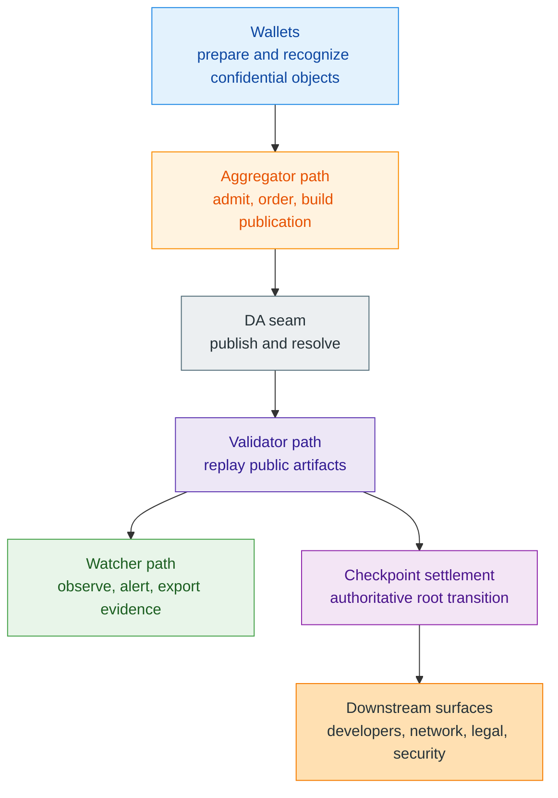

# Protocol Architecture

> [!warning]
> **Maturity:** `Live core + target operator topology`
>
> **Use this page when:** You need the role map before reading deeper pages on settlement, privacy, rights, or operator layers.

Z00Z architecture is easier to understand if you start from one question: **what is the smallest public surface that still makes settlement safe?** The answer is not a public balance table and not a universal smart-contract heap. It is a narrow set of public artifacts that let the network confirm that a candidate transition was authorized, replay safe, and linked correctly from one checkpoint root to the next. Everything else either happens wallet-local first or belongs to surrounding service and ecosystem layers.

That is why this page treats architecture as a boundary map rather than as an implementation inventory. The live codebase already exposes typed packages, checkpoint artifacts, validator verdicts, provider-facing publication seams, and watcher evidence. It does not yet justify pretending that every surrounding operator path is complete. The job here is to show the fixed center clearly enough that later pages can add nuance without changing the meaning of the core.

## System Map

The diagram shows a chain of responsibility, not a chain of equal authority. Wallets own private recognition and package preparation. Aggregators can order and hand work toward publication. DA layers can hold or resolve bytes. Validators can reject inconsistent artifacts. Watchers can surface publication anomalies. But the checkpoint settlement boundary remains the place where a prior root, next root, created outputs, consumed paths, and public proof material are bound together into something the protocol treats as authoritative.

## Core Invariants Before Detail

| Invariant | Why it matters |
| --- | --- |
| Settlement truth is checkpoint-bound. | A package can be portable and even published without yet being authoritative final settlement. |
| Wallet-local possession stays separate from public evidence. | Private ownership interpretation should not collapse back into a public account graph. |
| Publication and data availability do not define validity. | External providers may carry bytes, but they do not redefine what a valid Z00Z transition means. |
| Service layers cannot override invalid protocol evidence. | Wallet policy, bridges, custodians, or dashboards can add rules around the core, but not change theorem truth. |
| Live core and target topology must stay visibly separate. | The docs should not turn future operator or ecosystem work into present-tense protocol claims. |

These invariants are the architecture. The named modules, roles, and future integrations only make sense if they preserve them. That is why this page stays concept-first.

## Role Separation Without Authority Confusion

| Role | Primary job | Useful output | What it cannot claim |
| --- | --- | --- | --- |
| Wallet | Hold receiver material, recover owned objects, build packages, reconcile later evidence | Local inventory and transport-ready candidate transitions | Canonical finality by itself |
| Aggregator | Admit work, order batches, prepare publication requests | Ordered work and publication handoff | Final settlement truth |
| DA provider seam | Publish and later resolve batch bytes | Durable publication reference or availability outcome | Whether a transition satisfies Z00Z validity rules |
| Validator | Replay package, execution-input, proof, and root relations over public artifacts | Accepted or rejected public-artifact consistency verdict | Business honesty outside the protocol |
| Watcher | Track publication lag, missing blobs, inconsistent provider results, or validator incompleteness | Evidence, alerts, and observability | Finality, custody, or protocol redefinition |
| External ecosystem | Bridges, issuers, vaults, compliance overlays, and redemption flows | Real-world service surfaces around the protocol | Native settlement semantics |

This split is why Z00Z can support optional ecosystems without forcing every optional layer into consensus. The protocol owns validity and replay safety. Ecosystem services own the promises they make around that validity.

## Why Z00Z Calls The Chain A Settlement Notary

In a public account chain, the chain remembers the user-facing ownership model directly. In Z00Z, the chain remembers only the artifacts needed to prove a transition. That means public state is made of committed leaves, canonical paths, checkpoint roots, deltas, proofs, and links, while the wallet continues to own local interpretation of receiver material, imported packages, and spendable inventory. The chain is still real authority, but it is authority over settlement evidence rather than over a public account book.

That narrower public memory is also what opens room for rights-oriented extensions later. Once private objects can be prepared locally and settled publicly through the same checkpoint discipline, the protocol can describe vouchers, linked liability, cross-chain rights, and smart-cash families without first becoming a universal public VM.

## What Remains Target Architecture

Several important surfaces are already named, but they should still be read as extensions around the live core instead of as fully closed systems.

| Surface | Current posture |
| --- | --- |
| Dedicated production DA integrations | Real seam and named direction exist; full provider maturity still continues. |
| Rich operator recovery and automation | Status, verdict, and evidence vocabulary exist; complete operator-grade topology remains active work. |
| Full locker and external-asset verification | The internal right-transfer model is compatible today; foreign custody proof remains future integration work. |
| Full auditable or enterprise workflows | Some audit primitives exist, but end-to-end disclosure policy and evidence flow are still broader future work. |

The right reading is not "unfinished therefore unimportant." It is "important enough to be kept outside the live claim until it is backed by real verifier paths and real operational evidence."

## Read Next

Move next to [Settlement Model](/docs/protocol/settlement-model) if you want the concrete object vocabulary that turns this architecture into a public theorem. Move to [Wallet-Local Possession](/docs/protocol/wallet-local-possession) if the category boundary still feels abstract and you need the no-account ownership story in concrete wallet terms.

## Evidence and Further Reading

- `content/whitepapers/Main-Whitepaper.md` sections 2, 3, 4, and 10 define the settlement-notary architecture, canonical object graph, sovereign-rollup direction, and protocol-versus-service separation used here.
- `content/whitepapers/Privacy-Threat-Model.md` sections 3, 4, and 8 explain why transport, operator, and observability layers must not be confused with the core privacy theorem.
- `content/whitepapers/Legal-Architecture.md` and `content/whitepapers/DAO.md` reinforce the same role split in legal and governance language: the protocol can stay narrow while service and stewardship layers remain visibly separate.
