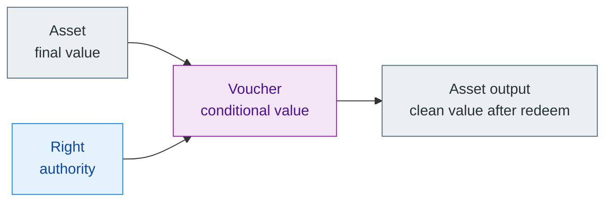

# Assets, Vouchers, And Rights

> [!tip]
> **Maturity:** `Live core + target object widening`
>
> **Use this page when:** You need the cleanest object vocabulary for private cash, conditional claims, and bounded authority.

Z00Z becomes easier to reason about once three ideas stop being collapsed into one object. Final spendable value is one thing. Conditional value is another. Authority without value is a third. This page keeps that split explicit so later protocol pages do not drift into vague “smart object” language where every object secretly carries money, policy, and power all at once.

The shortest stable rule is:

- `Asset` = final value
- `Voucher` = conditional value
- `Right` = authority

That triad is not just a naming preference. It is a safety boundary. If native cash starts carrying arbitrary conditional behavior, receivers stop knowing what counts as money. If rights start carrying hidden value, delegation becomes harder to reason about. If vouchers disappear, conditional claims get smuggled into either cash or authority and the object model becomes muddy.

## The Minimal Triad

| Object | Economic meaning | Carries value? | Carries authority? | Safe intuition |
| --- | --- | --- | --- | --- |
| Asset | Final spendable value | Yes | Only implicit spend authority in the native-cash case | “This is already money.” |
| Voucher | Reserved or conditional value claim | Yes | Only through declared policy branches | “This can become money under explicit conditions.” |
| Right | Bounded authority over an object, action, or family | No | Yes | “This lets me do something, but it is not itself money.” |

## Why Native Cash Must Stay Clean

The native asset should remain boring in the best sense of the word. A receiver should be able to recognize it as money, not as a private contract shell whose hidden restrictions travel silently from sender to recipient. That is why this paper keeps the clean-cash boundary narrow. Spend, split, merge, transfer, pay a fee, or intentionally convert into a voucher are the kinds of native-cash operations that stay legible. Unbounded per-output programmability does not.

If cash is allowed to carry arbitrary restrictions by default, several things degrade quickly:

- wallet accounting becomes harder to trust;
- one-sided payment semantics become less clear;
- toxic or unknown policy shells can land on recipients silently;
- the protocol starts drifting toward a disguised private VM instead of a private cash and rights system.

This page does not say no future object may ever have richer behavior. It says native cash should not be the default host for that experimentation.

## Why Vouchers Are Not Dirty Cash

A voucher exists because some value is real and economically meaningful, but the receiver should not yet treat it as final unrestricted cash. The condition may be time-based, recipient-scoped, issuer-scoped, partially redeemable, or attached to a refund path. The important point is that the conditionality belongs in the voucher, not hidden inside the cash object.

That is why voucher transfer and cash transfer are different events. After a cash transfer, the recipient has final spendable value. After a voucher transfer, the recipient has a claim whose redemption, rejection, expiry, or partial use still matters.

The clean MVP direction is a fully backed voucher model:

1. source value is reserved or consumed when the voucher is created;
2. the voucher becomes the live carrier of that conditional value;
3. redemption or refund transforms already reserved value instead of minting new value;
4. wallet UX can show that this object is economically meaningful without confusing it with ordinary spendable balance.

That is stronger than “cash with hidden rules,” because the lifecycle stays explicit.

## Why Rights Need To Stay Value-Free

Rights matter because the protocol is broader than coin transfer. A system may need to represent a redeem permission, delegation scope, machine capability, claim authority, or limited-use budget. Those are real economic objects, but they are not the same thing as value. A right should therefore say what may be done, under what limits, by whom, and until when, without secretly turning into a value container.

That boundary is what makes delegation safer. If a right can be narrowed, attenuated, or time-limited without also moving conditional value around, the holder can reason about authority separately from money. The moment a right starts carrying hidden balance, the design loses that clarity.

## Binding Rules Between The Three

| Relation | What should be explicit | What should never be implicit |
| --- | --- | --- |
| Asset -> Voucher | Which value source becomes conditional and under which voucher policy | “This payment was always secretly encumbered.” |
| Voucher -> Asset | Which redeem branch turns conditional value into clean output | Silent value creation or invisible side effects on unrelated balances |
| Voucher -> Right | Which right set, scope, or proof gate is required for redeem or refund | “The operator said it was allowed.” |
| Right -> Voucher | Which object or family the right may affect and with what attenuation | Delegation that increases power or leaks outside declared scope |

These rules keep the object model specification-ready instead of decorative. They also help later pages stay honest about maturity. The corpus already describes live asset-centric settlement and live right or voucher lanes under the broader settlement family. The fuller semantic split described here is the design direction that later implementations should converge toward, not a claim that every voucher workflow is already live today.

## What Readers Should Carry Forward

If you remember only one thing, remember this: Z00Z should not make the reader guess whether an object is money, a conditional claim, or authority. Private settlement is already hard enough. The protocol gets safer when those three meanings are kept explicit from the start.

## Evidence and Further Reading

- `content/whitepapers/Assets-Rights-Vauchers.md` sections 2 through 10 define the triad, explain why native cash must stay clean, and outline voucher and right semantics, policy binding, and settlement boundaries.
- `content/whitepapers/Main-Whitepaper.md` sections 3, 5, and 10 show how the current object-first settlement model and wallet-local possession thesis make this split coherent.
- `content/whitepapers/Smart-Cash.md` sections 4 through 7 explain why bounded smart-cash behavior should widen through typed objects and rights rather than through a universal hidden VM claim.
