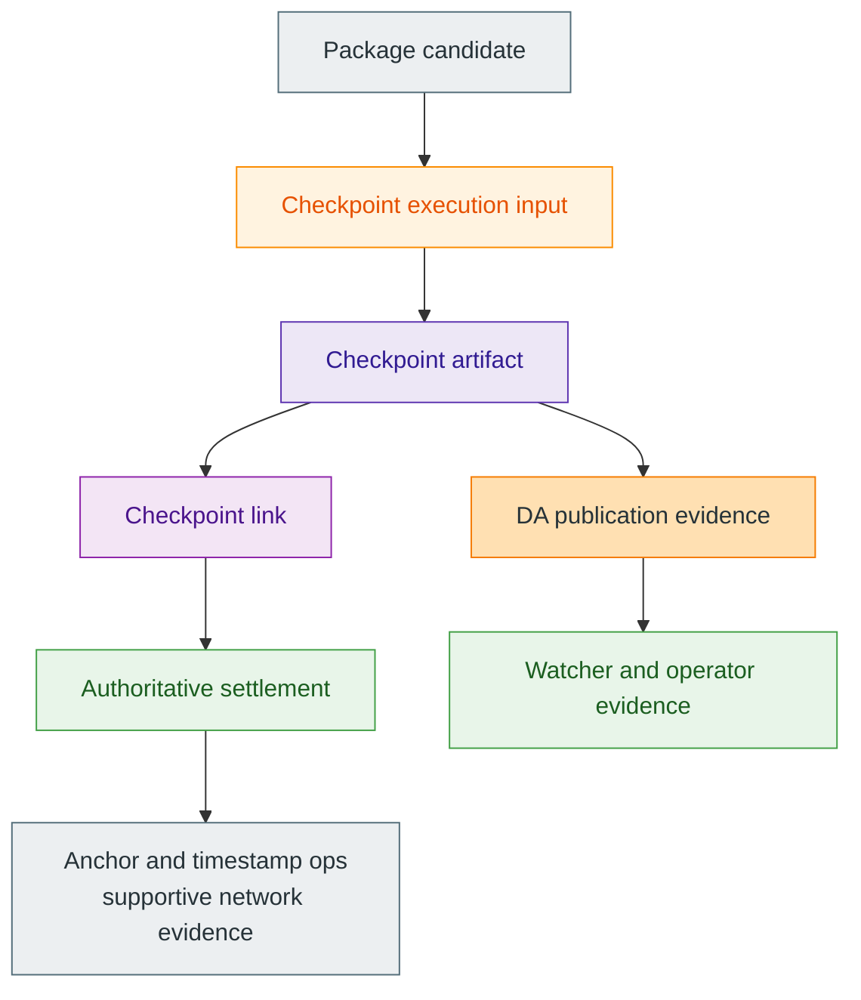

# Checkpoints And Public Evidence

> [!tip]
> **Maturity:** `Live core + in-progress publication layer`
>
> **Use this page when:** You need the public-evidence stack without confusing DA, anchors, watchers, or timestamps with settlement authority itself.

Checkpoints are the strongest public validation boundary in Z00Z today. A package can be portable, locally useful, admitted for publication, or even observed in a provider-facing pipeline without yet being final settlement. The checkpoint boundary is where previous root, next root, typed deltas, proof payload, and canonical linkage are checked together. That is why this page treats checkpoints as the center and everything else as supporting evidence around them.

The distinction matters because Z00Z intentionally uses several public layers at once. There is package-level evidence, checkpoint evidence, publication evidence, and eventually anchor or timestamp evidence. Those layers are related, but they do not all answer the same question.

## The Evidence Stack

| Evidence layer | What it answers | What it does not answer |
| --- | --- | --- |
| Package evidence | Is this candidate transition well formed, signed correctly, and internally consistent? | Whether it is already settled |
| Checkpoint evidence | Does this transition fit the claimed roots, deltas, replay inputs, and canonical linkage? | Whether an external reserve, issuer, or service promise is honest |
| DA publication evidence | Was the publication payload posted or later resolved through the configured availability path? | Whether the posted payload is valid Z00Z settlement by itself |
| Watcher evidence | Did publication stall, diverge, disappear, or trigger alerts? | Whether an alerted item is automatically invalid or automatically final |
| Future anchors and timestamps | Can later observers prove that checkpoint evidence existed at some external boundary? | Whether the external anchor becomes Z00Z's source of settlement truth |

This table is the main reading guardrail. Everything after the checkpoint boundary can strengthen auditability, recoverability, or operator observability. None of it should be described as replacing the settlement theorem.

## What Checkpoints Decide

The checkpoint layer decides whether the public state transition is valid. It binds the package to the execution input, the execution input to the artifact, and the artifact to the canonical link and root continuity path. If those relations fail, the transition is rejected. If they hold, the protocol has authoritative public settlement evidence.

That is the live core claim. It is already strong enough to matter, and it is deliberately narrower than "everything about publication is finished."

## What Supporting Layers Add

Publication and observability layers still matter a great deal. They answer different questions.

- DA publication layers help make the relevant bytes durable and later retrievable.
- Watchers help detect lag, missing blobs, retry stagnation, or divergent provider behavior.
- Future anchors, ZTS, or related timestamping surfaces can help prove existence or ordering at additional boundaries.

Those are valuable additions because real systems need recoverability and monitoring, not only theorem correctness. But Z00Z keeps them in the right place: around the checkpoint boundary, not instead of it.

## Why This Separation Improves Security

If publication or timestamp evidence were treated as settlement truth, an external provider could effectively redefine protocol validity. Z00Z avoids that mistake. A provider can fail, delay, or disappear. A watcher can observe a problem. An anchor can prove later that some artifact existed. None of those facts alone changes whether the underlying checkpoint transition satisfied the protocol's own rules.

That separation also keeps later network docs honest. [Checkpoint Anchors And ZTS](/docs/network/checkpoint-anchors-zts) should be read as a network-operations and evidence-distribution page, not as a page that silently takes authority away from the checkpoint theorem.

## Live Core Versus Future Publication Surfaces

| Surface | Current posture |
| --- | --- |
| Checkpoint artifact, execution input, and link boundary | Live core settlement contract |
| DA publication seam and named provider direction | Real interface and active implementation surface |
| Watcher alerts and evidence export | Real observability vocabulary with growing operator depth |
| External anchors, ZTS, and richer light-client flows | Important future evidence surfaces, not current settlement authority |

This maturity split is what lets the docs say something useful without exaggerating. The checkpoint core is already meaningful. The full publication ecosystem is still being hardened around it.

## Read Next

Continue to [Assets, Vouchers, And Rights](/docs/protocol/assets-vouchers-rights) if you want to see how the same checkpoint discipline can support several object families. Jump to [Network](/docs/network) if your next question is operational rather than conceptual.

## Evidence and Further Reading

- `content/whitepapers/Main-Whitepaper.md` sections 3.3, 4, and 8 define the checkpoint validation boundary, sovereign-rollup publication path, and typed publication pipeline that underpin this page.
- `content/whitepapers/Privacy-Threat-Model.md` section 8 explains what network or helper layers may improve and what they must not overclaim.
- `content/whitepapers/Linked-Liability.md` sections 5 through 7 show how conflict handling and reveal logic still depend on checkpointed public evidence rather than on provider-side observation alone.
