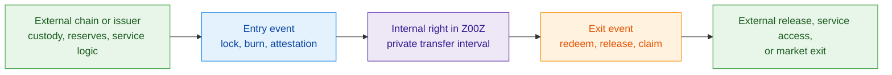

# Cross-Chain Rights

> [!warning]
> **Maturity:** `Target/current mixed`
>
> **Use this page when:** You need the honest cross-chain claim: what Z00Z guarantees internally and what still remains an external custody, issuer, or service promise.

Cross-chain integration in Z00Z starts from a disciplined premise: external systems already host real assets, liquidity, custody contracts, merchant surfaces, account UX, and redemption rails. Z00Z does not improve privacy by pretending all of that should be rebuilt inside one monolithic private chain. It improves privacy by refusing to make those public systems the place where every ownership reassignment must stay visible.

The key question is therefore not “how do we mirror tokens everywhere?” It is **where should public custody stop and private ownership reassignment begin?** The answer is that external systems keep the public anchor, while Z00Z privately moves the internal right linked to that anchor.

## External Systems Hold Assets, Z00Z Moves Rights

This is the central design move. A public chain or issuer route may still hold the actual stablecoin, wrapped asset, service contract, or reserve account. Z00Z then creates the private interval between entry and exit, so intermediate transfers do not have to remain a public graph on that source system.

## Why Z00Z Integrates Instead Of Replacing

External chains are already good at several things Z00Z should not pretend to replace all at once:

- EVM systems already host stablecoin custody and visible liquidity venues.
- Object-oriented chains can already host escrow or wrapped-asset containers.
- Application layers can already provide readable accounts, subscriptions, campaigns, or public consumer interfaces.
- Issuers and lockers already own reserve promises and redemption mechanics outside the protocol core.

Z00Z adds something different: a private, replay-safe ownership-transfer interval between public entry and public exit. That is why integration is a better framing than replacement.

## Asset Families Matter More Than Generic Bridging

Not every private payment-like object should be flattened into one generic “private dollar.” The corpus treats at least three important asset families as economically distinct:

| Family | Meaning comes from | What Z00Z can guarantee | What remains external |
| --- | --- | --- | --- |
| Externally backed wrapper | Locked reserves or an external issuer route | Private internal transfer of the right and replay-safe settlement | Reserve integrity, custody honesty, exit execution |
| Issuer-native private asset | The issuer definition and its own redemption promise | Private transfer after valid mint and checkpoint settlement | Issuer policy, supply discipline, redemption credibility |
| Synthetic internal unit | Internal accounting or incentive logic only | Private transfer within the unit's own rules | Any stronger real-world value claim beyond that definition |

This distinction is why naming, issuer domain, and asset-family identity are not cosmetic. Privacy applies across all three families. Economic meaning does not.

## Integration Objects And State Flow

The core settlement objects remain the same ones used everywhere else in the protocol family: `AssetDefinition`, `AssetLeaf`, packages, and checkpoints. Cross-chain integration adds a smaller outer ring of concepts: a locker or externally anchored control right, an entry event that must not replay, an exit event that consumes the internal right, and mapping data that says which external family corresponds to which internal one.

The protocol should therefore be understood as settling **confidential internal rights through a typed object graph**, while adapters translate external deposits, burns, service attestations, or custody facts into that same graph. That keeps the internal settlement model unified instead of inventing one special state model per bridge or issuer.

## Trust Boundary: What Is Inside And Outside The Protocol

| Surface | Inside Z00Z today | Outside in the external ecosystem |
| --- | --- | --- |
| Internal right representation | Yes | No |
| Private reassignment of control | Yes | No |
| Replay-safe checkpoint settlement | Yes | No |
| Reserve solvency, vault honesty, or redemption performance | No | Yes |
| Merchant, subscription, or service-side policy meaning | No, except as imported bounded claim context | Yes |
| Liquidity depth and price discovery | No | Yes |

This boundary is the reason the docs can speak strongly without overclaiming. Z00Z can guarantee that a valid internal right moved privately and settled correctly. It cannot, by itself, guarantee that an external vault stayed solvent or that an issuer will honor redemption on demand.

## Why This Generalizes Beyond Tokens

The same structure can support more than stablecoins. A right may point to an externally custodied asset, a merchant subscription lane, a service access entitlement, a payroll object, or a useful-work claim. What changes is the external meaning of the right. What remains stable is the private transfer interval inside Z00Z and the checkpointed settlement discipline that governs it.

That is why this page uses the phrase cross-chain rights rather than only cross-chain tokens. The internal thing that moves is a right with asset-family meaning, not just a mirrored visible balance.

## Current Versus Future Posture

The architecture direction is strong today. Full locker objects, foreign-custody verification, reserve attestation, and broader adapter ecosystems remain future work. The current repo already has the internal settlement machinery needed to host those systems later. It should not yet describe them as if the full bridge stack is already consensus-complete.

## Evidence and Further Reading

- `content/whitepapers/Cross-Chain-Integration.md` sections 1 through 3 define the integration thesis, service-composition boundary, asset-family discipline, and canonical integration objects summarized here.
- `content/whitepapers/Main-Whitepaper.md` section 7 explains the locker and external-asset direction from the main protocol perspective.
- `content/whitepapers/Assets-Rights-Vauchers.md` and `content/whitepapers/Smart-Cash.md` explain why the internal unit should be read as a bounded right or conditional object rather than as a generic mirrored public token balance.
