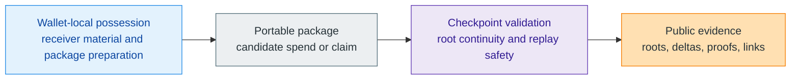

# Protocol

> [!warning]
> **Maturity:** `Live core + target extensions`
>
> **Use this section when:** You already understand the category claim and now need the architecture boundary: what becomes public, what stays local, and where future ecosystem layers begin.

The protocol family explains Z00Z as a private-object settlement model rather than as a public account chain with privacy added later. That distinction changes how every downstream page should be read. Wallets prepare and recognize confidential objects locally. Public verification checks only the artifacts needed to prove that a transition is authorized, replay safe, and consistent with checkpointed state. The result is a system that treats the chain more like a settlement notary than like a public wallet database.

This hub is the map for that model. It keeps the core story narrow enough to stay honest about maturity and broad enough to show why later pages on privacy, rights, external assets, and incentives all still belong to one architecture. If a reader starts anywhere in the protocol section, they should leave with three ideas intact: public settlement evidence is intentionally narrow, wallet-local possession is a first-class protocol boundary, and optional service or ecosystem layers do not redefine settlement truth.

## The Shortest System Model

The flow is intentionally smaller than the full operating stack. A wallet can prepare or recognize a spendable object before the network has finalized anything. The package can then enter admission, ordering, and publication. But the authoritative line is the checkpoint boundary, because that is where previous root, created outputs, consumed paths, proof payloads, and canonical linkage are checked together. Only after that step does the public chain become a trustworthy record of the transition.

## What This Family Treats As Authoritative

| Layer | What it owns | What it must not overclaim |
| --- | --- | --- |
| Wallet | Receiver material, ownership recovery, local inventory, package preparation, delayed-connectivity handoff | Final public settlement |
| Package | Portable spend or claim candidate with proof-bearing public fields | Automatic acceptance just because the package is well formed |
| Checkpoint | Replay-safe transition from prior root to next root with typed deltas and proof linkage | Custody, reserves, or business obligations outside the protocol |
| Public evidence | Roots, deltas, links, and published artifact references | A full public account graph of user ownership |
| Service and ecosystem layers | UX, compliance overlays, custody, bridges, issuers, redemptions, monitoring | The ability to redefine valid settlement evidence |

This table is the discipline for the whole section. If a concept belongs to wallet-local preparation, it should not be described as already public. If it belongs to an external bridge, issuer, or custody layer, it should not be smuggled into the base theorem as if the chain already proves it. That is why later pages repeatedly separate live core from target extensions.

## Reading Order

If you want the shortest path through the section, read it in this order:

1. [Protocol Architecture](/docs/protocol/architecture) for the role map and authority boundaries.
2. [Settlement Model](/docs/protocol/settlement-model) for the checkpoint objects that make finality real.
3. [Wallet-Local Possession](/docs/protocol/wallet-local-possession) for the no-account ownership model and offline-first semantics.
4. [Checkpoints And Public Evidence](/docs/protocol/checkpoints) for the publication, proof, and evidence stack.
5. The remaining pages for bounded extensions: rights, smart cash, liability, privacy, cross-chain composition, tokenomics, governance, useful work, and PQ migration.

That sequence mirrors the current maturity picture. The settlement spine is the live center. Everything else either explains why that center matters or shows how future layers can attach without changing the core meaning of valid settlement.

## Live Core Versus Target Extensions

| Surface | What can be said in present tense | What still needs future implementation or proof |
| --- | --- | --- |
| Settlement core | The protocol already has typed packages, checkpoint artifacts, replay-aware storage rules, and a public settlement theorem path. | Stronger publication closure, richer operator tooling, and broader production hardening still continue. |
| Wallet model | Wallet-local possession, receiver-native flows, and delayed-connectivity package handling are already central to the architecture. | Richer automated rights workflows and broader ecosystem UX are still future-facing. |
| Privacy | Confidential objects, stealth reception, and narrow public evidence are part of the current direction. | Full transport-anonymity overlays and richer disclosure regimes remain separate work. |
| External assets | The internal right-transfer model can already support future locker or wrapper ecosystems. | Reserve proofs, vault honesty, redemption liveness, and bridge-specific settlement are not yet base-layer facts. |
| Governance and incentives | The corpus defines a bounded constitutional direction for fees, DAO policy, and useful-work rewards. | Final economic policy, treasury execution, and mature governance operations remain draft or target architecture. |

This is the central anti-hype rule for the protocol docs. Z00Z becomes easier to evaluate when the live theorem path is treated as strong and specific, while optional ecosystems stay visibly conditional. The docs should reduce category confusion, not create it.

## Where The Section Connects Outward

- [Developers](/docs/developers) translates these concepts into repo-local builder surfaces and operational commands.
- [Network](/docs/network) describes how aggregators, validators, watchers, and publication layers surround the settlement core without becoming settlement truth themselves.
- [Security](/docs/security) expands the adversary model, threat boundaries, and residual risk posture.
- [Legal](/docs/legal) keeps protocol, stewardship, wallet, issuer, and service responsibilities separate in public claims.

Those families exist because the protocol family stays narrow. It does not have to absorb support, legal, custody, or operator narratives into one overloaded architecture page.

## Evidence and Further Reading

- `content/whitepapers/Main-Whitepaper.md` sections 2 through 4 define the settlement-notary thesis, canonical objects, checkpoint boundary, and sovereign-rollup direction that anchor this hub.
- `content/whitepapers/Privacy-Threat-Model.md` sections 3 and 4 explain why the protocol must minimize public observability without pretending the system has zero visible artifacts.
- `content/whitepapers/Linked-Liability.md` section 2 and `content/whitepapers/Assets-Rights-Vauchers.md` sections 3 through 7 show how broader rights, voucher, and liability concepts can extend the same settlement nucleus without replacing it.
