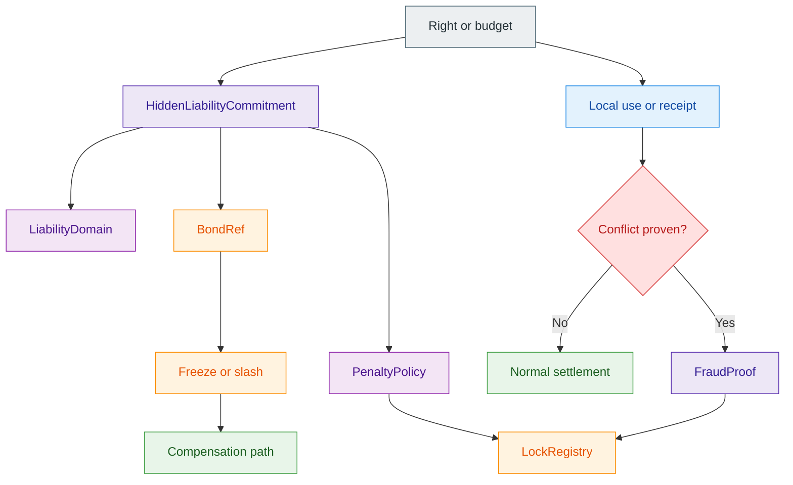

# Linked Liability

> [!warning]
> **Maturity:** `Target/current mixed`
>
> **Use this page when:** You need the protocol-side answer to “how can offline or delayed rights stay useful without making fraud consequence-free?”

Linked Liability is Z00Z's answer to a hard problem: private or delayed execution is useful, but pure prevention is unrealistic once value or authority can move before the whole network sees it. The protocol therefore needs a way to keep honest use private while making proven abuse economically attributable later. That is what linked liability adds. It does not turn Z00Z into a public reputation system, and it does not fall back to public account freezes. It binds a bounded right to a hidden responsibility lane that activates only if conflict becomes provable.

The design matters because many later use cases depend on it: offline payments, machine-service rights, API budgets, agent envelopes, or other delayed-settlement objects all become easier to trust when fraud cost is pre-attached instead of improvised after harm occurs.

## The Core Idea

| Honest case | Fraud case |
| --- | --- |
| The right stays privately usable under its normal object and policy rules. | A conflict proves that the same hidden responsibility lane was used incompatibly. |
| The liability domain remains hidden. | The liability domain becomes selectively revealable. |
| No public reputation account is created. | A bounded lock, slash, quarantine, or compensation path can activate. |

This asymmetry is the whole point. One valid use should not create a public identity hook. Two incompatible uses should be enough to move from private execution into bounded enforcement.

## Not A Public Account Freeze

The wrong mental model is “the wallet gets frozen.” That quietly reintroduces the account worldview Z00Z tries to avoid. The better model is narrower: a hidden `LiabilityDomain` becomes locked, future rights from that domain can be rejected or quarantined, and linked collateral can answer for proven harm. Unrelated honest activity should not automatically become public or globally immobilized.

That bounded scope is not cosmetic. It keeps the punishment surface aligned with the rights-first architecture instead of reverting to a giant identity bucket.

## Canonical Liability Objects

| Object | Role |
| --- | --- |
| `LiabilityDomain` | The bounded hidden responsibility scope behind a right family or offline lane |
| `HiddenLiabilityCommitment` | Private binding from a right to its liability domain, bond, and penalty logic |
| `FraudProof` | Conflict-triggered evidence that turns suspicion into an enforceable event |
| `BondRef` | Path to collateral or reserve that can absorb penalty and compensation |
| `PenaltyPolicy` | Rule set for slash, quarantine, cooldown, unlock, and victim handling |
| `LockRegistry` | Active case state that keeps the consequence persistent instead of historical only |

The system becomes meaningful only when all six are visible as a family. Without a bond, liability is moral language. Without selective reveal, it becomes surveillance. Without a registry, the consequence is not durable.

## Honest-Case Privacy

In the normal case, observers should not learn the hidden liability domain and should not gain a reusable public punishment tag. A wallet or provider can validate the local right, and later settlement can still accept the resulting transition, without disclosing the responsibility lane that would answer for fraud if conflict were later proven.

This is the main privacy rule of the design: **honest use stays on the normal settlement lane**. Liability exists, but it remains dormant. That is what keeps the mechanism compatible with Z00Z instead of mutating it into a public score system.

## Fraud Activation

Conflict becomes authoritative only when later reconciliation can compare the relevant receipts, packages, or spend artifacts under canonical settlement rules. A local suspicion is not enough. The system should require proof that incompatible uses came from the same hidden responsibility lane and that the requested enforcement action fits the bound policy.

That proof should reveal only what is necessary:

- that a conflict exists;
- which liability domain it activates;
- which bond or recovery surface answers for it;
- which penalty or unlock policy applies.

It should not reveal unrelated wallet history, unrelated rights, or a permanent public reputation graph.

## Scope Control Matters

Linked liability is only useful if the blast radius stays narrow. A domain-level lock should affect the responsibility lane that caused the problem, not every right the user holds everywhere else. This is especially important for machines, agents, or recurring service workflows, where one narrow failure should not automatically destroy unrelated honest activity.

That is why the docs describe the mechanism as domain-scoped and rights-oriented. The punishment surface should be at least as carefully bounded as the private right it protects.

## Current Versus Target Posture

The architectural direction is strong today. The exact production wire formats, fraud-proof encodings, and lock-registry mechanics remain target architecture. That is the honest maturity split. The protocol already has a clear place for liability-bound rights and conflict-triggered reveal. The full enforcement pipeline still belongs to implementation work that should stay visibly future-facing until it lands.

## Evidence and Further Reading

- `content/whitepapers/Linked-Liability.md` sections 2 through 7 define the protocol thesis, hidden liability domains, canonical objects, honest-path privacy, fraud-proof extraction, and bounded enforcement path.
- `content/whitepapers/Main-Whitepaper.md` sections 5, 9, and 10 explain why delayed settlement needs bounded fraud handling and why protocol-versus-service separation still matters during enforcement.
- `content/whitepapers/Privacy-Threat-Model.md` sections 3, 4, and 9 explain how exculpability, selective reveal, and operator boundaries affect the privacy reading of liability activation.
