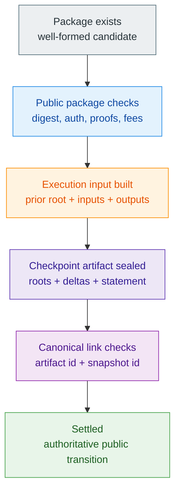

# Settlement Model

> [!note]
> **Maturity:** `Live core`
>
> **Use this page when:** You need the precise answer to “when does a Z00Z transition become authoritative?”

Z00Z settlement is not the same thing as package creation, local acceptance, or even early publication. A candidate spend or claim becomes authoritative only when the protocol can bind the package to the correct previous root, the correct created and consumed objects, the correct proof payload, and the correct checkpoint linkage. That is why the docs keep repeating that the chain acts like a settlement notary. It notarizes a valid public transition. It does not simply store whatever a wallet exported.

This page is the narrowest technical center of the protocol family. If a reader understands these objects and this sequence, later pages on privacy, liability, smart cash, or cross-chain composition are much easier to evaluate honestly.

## The Canonical Settlement Objects

| Object | What it carries | Why it exists |
| --- | --- | --- |
| `AssetLeaf` | Public committed settlement payload for one live confidential object | Gives the protocol a concrete public object to create, preserve, or remove |
| `SettlementPath` | Canonical locator for where a committed object lives in state | Makes spent-versus-live state a path question, not an account-balance question |
| `TxPackage` | Ordinary spend candidate with public verification fields | Lets wallets carry a portable transition candidate before final settlement |
| `ClaimTxPackage` | Claim-domain candidate with separate replay context | Keeps claim replay semantics explicit instead of overloading ordinary spends |
| `CheckpointExecInput` | Previous root, input references, outputs, and proof bytes for one candidate transition | Turns package intent into replay-ready public transition input |
| `CheckpointArtifact` | Final public artifact with roots, deltas, statement binding, and proof payload | Seals the candidate transition into a checkpointed settlement statement |
| `CheckpointLink` | Identity and continuity link between artifact, execution input, and snapshot | Protects continuity and prevents detached artifact drift |

The protocol does not need a permanent public account table because these objects already tell it what happened: which paths were consumed, which leaves were created, what prior root the transition built from, and how the public evidence should be linked and verified.

## When A Transition Becomes Authoritative

Each step answers a different question.

- Package verification asks whether the candidate transition is structurally valid and internally consistent.
- Execution-input construction asks whether the public transition is anchored to the right prior state and the right input or output set.
- Checkpoint sealing asks whether the candidate transition can be expressed as a typed root-to-root state change.
- Link validation asks whether the artifact identity, snapshot identity, and execution-input identity actually fit together.

Only after those questions line up does the system have what this docs family treats as settlement.

## Replay Safety Is Storage-Owned

Replay protection in Z00Z is not a vague promise that “the chain remembers a spend.” It is owned by storage and checkpoint contracts. If a consumed path no longer exists where it should, or if a root or replay entry does not match the claimed transition, the checkpoint path fails closed. That is why consumed rights are better understood as removed canonical objects than as a public balance row with a different flag.

Claims make the same point from a second angle. A claim flow can use a separate claim-domain nullifier for replay control while still creating or consuming ordinary settlement objects under canonical paths. The nullifier protects repeated claim identity use. The state transition still lives in the checkpointed object model. The protocol therefore avoids a misleading shortcut where one global nullifier story pretends to explain all spent-state semantics.

## What Settlement Proves

| Settlement can prove | Why that matters |
| --- | --- |
| The public artifact bundle is internally consistent. | Invalid or drifted proof payloads, links, or roots can be rejected. |
| The transition follows the claimed previous root. | Finality depends on continuity, not only on one package existing. |
| The claimed outputs and consumed inputs fit the checkpoint statement. | Created and removed state stay typed and auditable. |
| The protocol's replay rules were satisfied for this transition. | A candidate spend can be portable without being replayable forever. |

These are strong guarantees. They are enough to support the rest of the protocol family. They are also deliberately narrower than many blockchain narratives.

## What Settlement Does Not Prove

Settlement does not prove that a foreign reserve exists, that a bridge operator is honest, that an issuer will redeem an external promise, or that a service provider behaved fairly outside the protocol boundary. It also does not mean that every wallet-local action was risk free before publication. A receiver can import and inspect a package locally before final network reconciliation, but the protocol still distinguishes that local fact from canonical finality.

This narrow scope is a feature, not a weakness. It lets Z00Z be exact about what the chain must guarantee while keeping external business, custody, and policy promises visibly separate.

## Why The Model Scales

The settlement model scales because the public chain only needs the typed evidence required for the transition, not a giant public account history. Validators can reason about roots, deltas, package integrity, and inclusion relations instead of rebuilding a shared balance table for every wallet. That smaller public memory is what makes the settlement-notary framing coherent: enough public evidence to reject invalid transitions, but not more public ownership structure than the protocol needs.

## Read Next

Read [Wallet-Local Possession](/docs/protocol/wallet-local-possession) next if you want the user-side half of this theorem: how wallets can prepare and recognize spendable objects before the checkpoint boundary settles them. Read [Checkpoints And Public Evidence](/docs/protocol/checkpoints) if you want the broader evidence stack around publication, anchors, and operator observability.

## Evidence and Further Reading

- `content/whitepapers/Main-Whitepaper.md` sections 3.1 through 3.3 define the canonical object set, cryptographic discipline, checkpoint validation boundary, and settlement-theorem path summarized here.
- `content/whitepapers/Main-Whitepaper.md` section 8 explains why typed roots and deltas matter for scalability and why the protocol does not need a public account replay model.
- `content/whitepapers/Linked-Liability.md` sections 3 through 5 and `content/whitepapers/Assets-Rights-Vauchers.md` sections 8 through 10 show how claim, right, and replay-specific extensions still fit the same checkpointed settlement nucleus.
