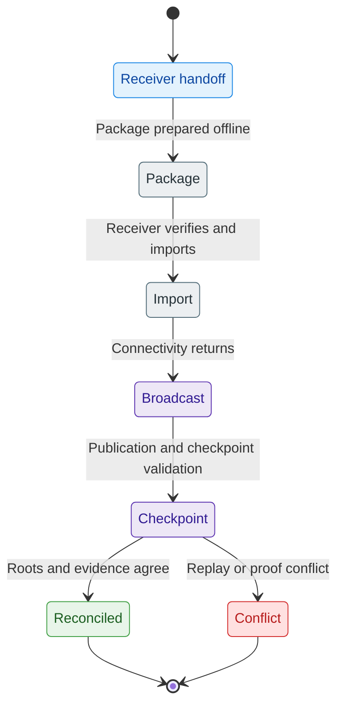

# Wallet-Local Possession

> [!note]
> **Maturity:** `Live core`
>
> **Use this page when:** You want the shortest defensible explanation of why Z00Z does not organize ownership around a public account table.

Wallet-local possession is one of the main category boundaries in Z00Z. A user does not primarily own value because a public ledger shows a reusable address with a visible balance. A user owns value because their wallet can recognize, decrypt, validate, and later authorize confidential objects that still exist under canonical public state. The public chain remains authoritative for settlement, but the wallet remains authoritative for local ownership interpretation until that settlement happens.

That distinction is the reason Z00Z can speak about privacy and offline-first handling in the same sentence without pretending local handoff is identical to finality. The wallet can act before the network settles. It cannot unilaterally replace the network's settlement decision.

## What The Wallet Actually Owns

| Wallet-local surface | What it does | Why it is not a public account row |
| --- | --- | --- |
| `ReceiverCard` | Carries signed receiver routing material | It is a bounded receive surface, not a permanent public balance index |
| `PaymentRequest` | Adds one-time receive context such as request identity, expiry, or amount hints | It narrows one workflow instead of creating a reusable public ownership record |
| `TxPackage` | Carries a portable candidate spend or claim | It can move across a connectivity gap before final settlement |
| Detected or claimed asset state | Lets the wallet recognize owned confidential objects locally | Ownership meaning depends on local keys and successful wallet-side recovery |
| Recovery and scan state | Lets the wallet resume discovery and reconciliation later | Recovery follows wallet-local derivation and scan progress, not public-balance replay |

This is why the docs use the phrase possession instead of balance. The wallet does not merely display a public number. It maintains the local interpretation layer that makes confidential objects useful in the first place.

## No-Address Ownership In Practice

The no-address model does not mean the system has no routing artifacts. It means routing artifacts are not the final ownership primitive. A sender can use a signed receiver card or a bounded payment request. The public chain can still commit a leaf that contains public fields such as commitments and proof-bearing metadata. But the actual meaning of “this is mine” is recovered wallet-side through local keys, local scanning context, and successful validation of the carried object.

That is a narrower and more honest claim than “nothing public exists.” Public evidence still exists. What does not exist as the user-facing ownership anchor is a long-lived public account row that all observers and service layers can treat as the user's economic biography.

## Offline-First Does Not Mean Instant Finality

The diagram is the shortest safe description of offline behavior. Two parties can exchange receiver data and a portable package before the whole network is involved. The receiving wallet can verify and import that package locally. But the protocol still requires later publication, replay checks, root continuity, and checkpoint validation before the state becomes authoritative.

That arbitration window is not an accident. It is the price of letting private objects remain useful during delayed connectivity while keeping final settlement replay safe.

## Wallet Responsibilities Are Protocol-Critical

In many blockchain systems the wallet is mostly a signing surface plus a UI shell. In Z00Z the wallet carries more architectural weight.

It must:

- manage receiver material and request-aware receive flows;
- scan candidate leaves and distinguish transient detection from claimed ownership;
- reject untrusted cards, requests, or packages that do not match local keys or chain context;
- import externally received packages without confusing import with final settlement;
- preserve recovery and scan progress so private ownership can be reconstructed later;
- reconcile claimed state once confirmation evidence and checkpoint outcomes return.

That is why wallet-local possession is part of the protocol story, not only a product or UX detail. If the wallet boundary becomes sloppy, the privacy and offline model becomes sloppy with it.

## What The Wallet Must Not Overclaim

The wallet should never imply that local import alone equals final settlement. It should not imply that a scanned card or request is itself proof of spend authority. It should not imply that all delayed-connectivity flows are risk free. And it should not imply that privacy means freedom from every metadata or service-layer leak.

These constraints protect the reader from two common mistakes:

1. Thinking Z00Z is just a fancy address system with more encryption.
2. Thinking offline-local usefulness means the chain no longer matters.

Neither is true. The wallet is stronger than a public account dashboard, and the chain is still the settlement judge.

## Why This Model Matters Beyond Cash

Once the wallet can privately carry spendable objects across a delay and later reconcile them through checkpoints, the same pattern can support more than coin transfer. Vouchers, claims, bounded service permissions, machine budgets, and other rights-oriented objects can all fit the same rule: useful locally first, authoritative publicly only after settlement. That broader direction belongs to later pages, but it starts here with the possession boundary.

## Evidence and Further Reading

- `content/whitepapers/Main-Whitepaper.md` sections 5 and 6 define wallet-local object ownership, offline payments, receive flows, recovery, and privacy-bound stealth reception.
- `content/whitepapers/Main-Whitepaper.md` section 2.2 explains why public leaves and private possession coexist instead of cancelling each other out.
- `content/whitepapers/Privacy-Threat-Model.md` section 7 explains why wallet UX, safe defaults, and receive guidance are part of the privacy boundary rather than optional interface polish.
