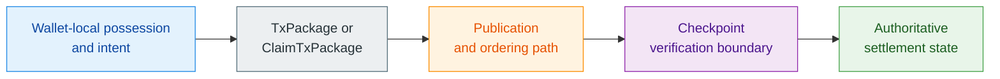
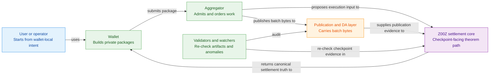

# Z00Z Litepaper

[TOC]

Version: 2026-06-27

This litepaper is the short companion to the Z00Z document corpus. It summarizes the protocol thesis, the present-tense implementation boundary, and the expansion path developed across the main whitepapers. It is written for first-pass readers who need the architecture, the non-claims, and the strategic wedge in one place.

## Key Terms Used In This Paper

This paper keeps a short vocabulary on purpose. A fuller shared-term map appears in [Z00Z Corpus Terminology And Abbreviations Reference](Z00Z-Corpus-Terminology-Reference.md), and Appendix A below points to the right companion papers across the wider corpus.

- `AssetLeaf`: The confidential settlement object that represents one live asset right in canonical state.
- `TxPackage`: The wallet-side canonical envelope for an ordinary private transfer before publication.
- `ClaimTxPackage`: The wallet-side canonical envelope for a claim-domain flow such as issuance, redemption, or reward claim.
- `Checkpoint`: The public validation boundary at which a candidate transition becomes authoritative settlement.
- `Wallet-local possession`: Ownership material, receiver data, and transfer preparation that remain in the wallet before publication.
- `Linked Liability`: The hidden responsibility model that keeps honest offline use private while making provable fraud attributable, punishable, and compensable.
- `Locker`: An external custody surface that holds an asset outside Z00Z while Z00Z privately transfers the internal ownership right.
- `FeeCredit`: A non-transferable prepaid processing entitlement backed by locked or budgeted `Z00Z`.
- `FeeEnvelope`: The processing guarantee paired with a right transition, defining how verification, batching, publication, or relay are paid even when the right itself is not a coin.
- `Agent spending envelope`: A bounded private mandate that gives an agent a task-scoped budget, fee capacity, and action limits without granting full wallet authority.

## 1. Why Z00Z?

Z00Z exists because public-state blockchains are good at publishing shared facts and poor at preserving cash-like privacy. Once a system organizes value around reusable public accounts, visible balances, and permanent transaction graphs, it reveals treasury flows, supplier relationships, payroll rhythms, donor networks, and personal spending patterns by design. That visibility is useful for some products, but it is the wrong default for money, rights, and sensitive economic coordination.

Z00Z starts from the opposite assumption. Privacy should be structural, not cosmetic. The chain should not become the user's public wallet interface. It should become the narrow settlement surface that proves correctness, replay safety, and finality, while possession and transfer meaning stay local to the wallet until publication.

The first-pass problem can be stated as three linked failures of the public-account model. It exposes economic behavior by default. It pushes agents and autonomous machines toward reusable wallet authority instead of bounded rights. And it assumes live public verification at the moment of action even in settings where local verification and later reconciliation are the more practical trust model.

### 1.1 The Gap In Public Blockchains

The main gap is not only that many blockchains lack strong encryption. The deeper gap is architectural. Public account systems naturally make activity legible because their core product is continuously visible shared state. Even if some payload fields are hidden, the public account graph usually remains visible enough to reconstruct behavior.

Z00Z addresses that gap by avoiding a public account table as the primary ownership model. Public state still exists, but it is narrower. It records committed settlement objects, replay-sensitive transitions, checkpoint artifacts, and the evidence needed to reject invalid or conflicting state changes. It does not aim to become a public lifelong dossier of every wallet.

### 1.2 Reader Promise And Design Boundary

After reading this document, a new reader should be able to answer three questions clearly. What kind of protocol Z00Z is. What it can honestly claim today. Why the broader corpus treats Z00Z as a rights-first private settlement layer rather than as another transparent smart-contract chain with privacy features.

This litepaper is intentionally narrower than the full corpus. It does not re-specify every proof system, every legal nuance, or every future subsystem. It gives the minimum coherent picture needed to understand the architecture, the trust boundaries, and the expansion path.

## 2. Protocol Thesis

Z00Z is a privacy-first digital cash and private settlement protocol. Its live core is asset-centric, package-centric, and checkpoint-centric rather than account-centric. Wallets prepare and recognize private objects locally. The chain later accepts only the public evidence needed to prove that a transition was authorized, replay-safe, and consistent with checkpointed state.

That same state model also points beyond plain coin transfer. Once ownership is modeled as wallet-local private objects plus narrow settlement evidence, the architecture can support claims, vouchers, externally backed rights, policy-shaped money, organizational settlement, useful-work payouts, and bounded rights for machines or agents. Digital cash is the clearest live expression of the model, but not its only expression. That is why the corpus keeps moving away from the question "which wallet controls the account?" toward the question "which private object, claim, or bounded right is being carried, consumed, and later settled?"

### 2.1 Digital Cash And Private Rights

The shortest defensible category claim is that Z00Z turns money, conditional claims, and related economic authority into private wallet-local objects and bounded rights that later become narrow public settlement evidence. That is a different starting point from a chain where the canonical truth is a visible account or visible contract state.

This is why the corpus frames Z00Z as both a digital cash layer and a broader rights-first architecture. The wallet is where possession makes sense. The checkpoint boundary is where settlement becomes authoritative. The chain is not asked to mirror the full internal world of the wallet in real time.

### 2.2 Blockchain As Settlement Notary

Z00Z is best understood as a settlement notary over public evidence rather than as a public balance ledger. Wallets prepare `TxPackage` and `ClaimTxPackage` objects locally. Verifiers then examine the package, its proof and authorization structure, its replay-sensitive context, and its relationship to the checkpoint execution path. If those parts agree, the transition may cross the settlement boundary. If they do not, the transition is rejected.

This keeps the public layer strict without making it broad. Z00Z narrows what becomes visible, but it does not weaken finality discipline. Soft operational progress can exist before settlement, yet final authority still belongs to checkpoint verification.

### 2.3 What Z00Z Is And Is Not

The corpus is strongest where it says what Z00Z is not as clearly as it says what it is.

| Z00Z is | Z00Z is not |
| --- | --- |
| A privacy-first settlement and digital cash protocol | A transparent public account chain with cosmetic privacy |
| A wallet-local possession model plus public checkpoint verification | A system where the chain directly expresses the user's full wallet state |
| A rights-first architecture that can extend beyond plain coins | A claim that every future rights category is already live today |
| A sovereign-rollup-style settlement stack with externalizable publication | A protocol whose execution semantics are defined by its data-availability provider |
| A protocol separated from issuers, lockers, wallets, bridges, and service overlays | A monolithic operator product that must own every surrounding function |

## 3. Core Protocol Model

Z00Z becomes much easier to understand once it is described through a small set of canonical objects instead of generic blockchain language. The live public settlement object is `AssetLeaf`. Wallets prepare `TxPackage` and `ClaimTxPackage` envelopes. Checkpoint execution inputs, checkpoint artifacts, and replay-coupled storage rules define whether a transition becomes authoritative settlement.

### 3.1 Wallet-Local Possession And Confidential Asset State

The key design move is that ownership meaning stays local to the wallet while public state stays leaf-oriented. If a confidential asset leaf remains present under its canonical state path, that right is still live in the system. If a valid checkpointed transition removes that path and creates another, the right has been consumed and reassigned. The authoritative public rule is therefore presence or absence of committed leaves, not mutation of a globally readable balance table.

This allows Z00Z to preserve privacy without pretending that nothing is public. The chain still sees committed objects and settlement evidence. What it avoids is a reusable public account model that reveals the full ownership graph as a first-class product.

### 3.2 Transfers, Claims, And Replay

Z00Z distinguishes between ordinary transfers and claims. A transfer moves a right that the sender already holds. A claim materializes a right from a pre-authorized claim source under a claim-specific proof and replay contract. This distinction matters because it allows the protocol to express issuance, redemption, useful-work payouts, and other claim-domain flows without collapsing them into generic mint language.

Replay discipline is equally important. The protocol uses typed replay boundaries, including claim-domain anti-replay artifacts where appropriate, but the deepest spent-state rule still lives at the checkpoint and storage boundary. A right is live while its canonical leaf remains present in state and consumed when that leaf is validly removed.

### 3.3 Checkpoints As Settlement Boundary

The decisive finality rule in Z00Z is that a package is not yet settlement. Wallets can build, exchange, import, and verify packages before publication. Operators can admit and order work. A batch can receive a soft operational signal on its publication path. None of those events alone defines authoritative settlement.

Settlement becomes authoritative only at the checkpoint boundary. There the protocol binds package contents, execution input, checkpoint artifact, replay context, and root continuity into one public verification relation.

**Figure 3.1 - Wallet to settlement path.** Ownership meaning begins in the wallet, while final authoritative state begins only after checkpoint verification.

## 4. Architecture, Publication, And Visibility

Z00Z targets a sovereign-rollup-style architecture. External publication and data availability may be modular, but the meaning of a valid Z00Z transition remains local to Z00Z's own protocol rules. This keeps execution semantics, replay safety, and checkpoint settlement inside the Z00Z boundary even when surrounding publication infrastructure is externalized.

### 4.1 Sovereign Rollup Model

The architecture separates execution meaning from publication plumbing. Data availability providers can carry batch bytes and support resolution, but they do not define what a valid Z00Z state transition means. The protocol itself owns the canonical objects, verification rules, replay boundaries, and checkpoint settlement theorem.

That separation matters because it lets Z00Z use modular publication infrastructure without becoming a thin application on someone else's state model. External publication is an integration layer. Z00Z settlement meaning remains protocol-owned.

### 4.2 Roles Around The Settlement Core

The corpus consistently separates roles around the checkpoint boundary. Aggregators admit and order work. Publication and DA-facing infrastructure move or resolve batch data. Validators re-check artifact consistency. Watchers surface publication anomalies, replay-related issues, and operational failures. Wallets remain the place where private possession and package preparation make sense.

This role split prevents soft operational progress from being confused with final settlement truth. Operators can move work through the pipeline, but they do not redefine execution semantics. The checkpoint boundary remains the final public theorem path.

**Figure 4.1 - Settlement-core system context.** The litepaper needs one
reader-first map of the actors around the checkpoint boundary before later
chapters widen the architecture.

### 4.3 Privacy, Selective Disclosure, And Honest Visibility

Z00Z privacy is best described as a visibility contract. The strongest live claim is not that nothing is visible. The strongest live claim is that the protocol avoids a reusable public account graph and reduces visibility to the minimum needed for replay-safe settlement. Wallets recover ownership meaning privately through receiver data and local secrets. The public layer sees committed objects and checkpoint evidence.

The corpus also draws a second boundary that matters for honest communication. State privacy is stronger today than full transport anonymity. Stronger ingress privacy, onion-style transport, and broader network-layer metadata resistance belong to an important expansion track, but they are not the same thing as the present live settlement claim. Selective disclosure for enterprise, audit, or regulated-service contexts is also part of the architecture, but it belongs above the core rather than inside consensus by default.

## 5. Offline Execution, Linked Liability, And External Asset Rights

Z00Z is designed for a world where local action can happen before global settlement becomes visible. That is why the corpus puts so much weight on delayed reconciliation, fraud realism, and the separation between internal private rights and external public asset anchors.

### 5.1 Spend-Then-Reconcile

The strongest cash-like pattern in Z00Z is spend-then-reconcile. Two parties can exchange private payment or claim material locally, then publish and reconcile later. This does not mean local exchange automatically equals final settlement. It means ownership and transfer intent can begin in the wallet, while the network later decides whether the transition was valid, whether the referenced right was still live, and whether the checkpointed settlement path accepts it.

This delayed-connectivity model is important because it makes Z00Z useful in conditions where a constantly online public account model is awkward or too revealing. It also forces the architecture to stay honest about what finality means.

### 5.2 Linked Liability As The Realism Layer

Offline or delayed execution cannot truthfully promise that conflicting local use becomes physically impossible before consensus. The stronger and more honest promise is different: if conflicting use occurs, the system should make it attributable, punishable, and economically irrational to repeat. That is the purpose of Linked Liability.

In the corpus, Linked Liability is the hidden responsibility layer attached to bounded offline, delayed, or autonomous execution lanes. Honest use keeps that responsibility surface private. Provable conflict activates it. The result is not a public reputation system and not a public account freeze. It is a bounded liability domain that can lock, slash, compensate, quarantine, or delay future rights until the case is resolved.

### 5.3 External Chains Hold Assets, Z00Z Moves Rights

The cross-chain thesis follows the same logic. External systems already host assets, custody, liquidity, and service interfaces. Z00Z does not need to replace those public layers. It creates the private interval between public entry and public exit. An external asset can be locked, attested, or otherwise mapped into Z00Z. The internal ownership right can then move privately inside Z00Z before later redemption, release, or external settlement.

This is why the corpus speaks about lockers and external asset rights rather than just about bridging tokens. Z00Z can guarantee private internal transfer and replay-safe settlement of the internal right. It cannot by itself guarantee external reserves, issuer honesty, or redemption willingness. Those guarantees remain external and must stay described as such.

## 6. Why The Design Matters In Practice

The practical power of Z00Z is not one narrow niche. It is that several distinct use-case families all depend on the same architecture: wallet-local possession, private rights, delayed reconciliation, narrow settlement evidence, and clean protocol-service separation.

### 6.1 The Six Core Application Families

The wider corpus converges on six core families.

| Family | What the private object represents | Why Z00Z is a natural fit |
| --- | --- | --- |
| Offline-first private cash | Portable payment value | Local exchange can happen before later checkpointed settlement |
| Private rights over external assets | Control over externally custodied or issued value | Ownership can move privately without public reassignment on the custody chain |
| Policy-shaped money and claims | Vouchers, subscriptions, merchant-bound money, delayed claims | Policy can travel with the spendable object instead of living as visible public app state |
| Private organizational settlement and selective disclosure | Payroll, B2B netting, treasury privacy, scoped audit flows | Sensitive graphs stay private while designated parties can receive bounded evidence packages |
| Private distribution and community money | Aid, vouchers, community currency, donor or relief flows | Recipients and circulation patterns do not need to become public surveillance data |
| Machine and agent rights | Agent spending envelopes, API and tool credits, compute budgets, DePIN machine rights, work claims | Non-human actors can hold bounded authority without full wallet control |

In market terms, these families already map to concrete wedges. Private rights over external assets point toward stable-value and other externally backed asset rails through independent issuers or lockers. Machine and agent rights point toward AI agents, API and tool payments, autonomous machines, and DePIN-style local resource markets. Private distribution and community money point toward local economy programs, aid, and merchant-bound circulation. The point of the architecture is that these do not require six different settlement systems.

#### Retail Reader Shortcut

For a new user, the most legible benefits are the ones that change day-to-day
wallet behavior rather than the ones that require institutional context. The
full source-of-truth retail map lives in the use-cases paper. The table below is
the short public summary that should stay aligned with that longer document.

| User-facing benefit | Why it feels different from ordinary public-chain UX |
| --- | --- |
| Private personal payments | A payment to a person or merchant does not need to become a permanent public counterparty graph |
| Offline or low-connectivity handoff | A QR, NFC, or portable package exchange can matter before later checkpointed settlement |
| Private subscriptions and merchant-scoped claims | Recurring or scoped spending can use bounded private claims instead of broad public allowances |
| Private vouchers, coupons, and community units | A recipient can receive and redeem value without turning the whole distribution graph public |
| Accountless paid sessions and access rights | A user can buy one bounded article, VPN session, download, or service slot without a standing visible account relationship |

When the surrounding workflow also adds `FeeCredit`, sponsor-paid execution, or
another bounded fee path, first-use friction can fall further because the user
does not need to preload a visible gas balance before every claim or right
transition.

### 6.2 Why They Form One Strategic Wedge

These families are not random verticals. They are different faces of the same rights-first settlement model. Public account systems usually express them as visible balances, visible contract state, or always-online coordination. Z00Z instead lets value or authority move first as a private object and become public only through narrow settlement evidence later.

That is the strategic wedge. Z00Z is not trying to replace every public chain at its own strongest job. It is opening a space where money, rights, claims, and bounded authority can remain private for much more of their lifecycle without sacrificing disciplined public settlement.

## 7. Native Asset, Treasury, And Useful Work

The corpus does not support either extreme token story. Z00Z is not a pure one-token monopoly economy in which every useful activity must route through the native asset as a business token. But it is also not a fully neutral system in which the native asset has no hard role. The stronger middle path is that `Z00Z` remains mandatory for core settlement accountability while higher-layer business models remain more flexible.

### 7.1 What The Native Asset Must Do

The native asset has a narrow but important job.

| Native role | Why it matters |
| --- | --- |
| Canonical base settlement fee | Keeps a protocol-owned fee lane at the core settlement boundary |
| Core operator bond floor | Gives the protocol a scarce internal collateral language for accountable operation |
| Default collateral language for Linked Liability | Makes delayed-connectivity abuse answerable through bonded downside |
| Backing for `FeeCredit` | Allows wallets, agents, devices, or sponsors to prepay processing without exposing a public account balance model |
| Treasury and budgeting denominator | Keeps long-horizon protocol accounting, grants, and public-work incentives legible |

That fee lane should be read together with `FeeEnvelope`-style execution paths above it. A claim, voucher, agent mandate, or machine right may not itself be denominated in `Z00Z`, but any transition that reaches publication still needs an explicit processing guarantee. Depending on the workflow, that guarantee may come from a native fee output, a `FeeCredit`, sponsor-paid execution, or a bounded embedded budget. The right answers what can be done. The fee envelope answers how settlement work gets paid.

### 7.2 Operator Economics In One Loop

Aggregators and related operators should earn for admitted and published work, not for vague token appreciation. The core fee lane compensates settlement handling and publication. Optional service-local fees may sit above that lane for asset-local or workflow-local services that operators voluntarily support. Bonds and liability collateral supply downside. The resulting loop is simple: post accountable capital, process real work, earn explicit fees, and lose capital if publication or delayed-connectivity lanes are abused.

### 7.3 What It Must Not Monopolize

The native asset should not become a forced business token for every local economy, issuer, or service stack built above Z00Z. That would make the project easier to market in one sentence, but weaker economically and legally. The better design keeps `Z00Z` necessary for core settlement, security, and budgeting while still allowing issuer-specific, asset-local, or service-local economies above the protocol line.

This is especially important for external assets, local vouchers, machine services, and agent workflows. They can settle through Z00Z's privacy-first infrastructure without pretending that every real business relationship is fundamentally a demand story for one native asset.

### 7.4 PoUW And Rule-Bound Incentives

The same discipline applies to incentives. The corpus frames Proof-of-Useful-Work as a rule-bound reward system for verified useful outcomes rather than passive holding, empty activity, or speculative attention. The key architectural point is that Z00Z core should stay narrow while useful-work evaluation can happen in a separate review and attestation layer above the protocol boundary.

That means the protocol can support private reward claims and anti-replay reward redemption without becoming a subjective scoring machine. Treasury use can stay bounded, challengeable, and evidence-driven rather than discretionary theater.

## 8. Governance, Legal Boundary, And Ecosystem Scope

The corpus repeatedly makes the same institutional point: privacy is not defended by cryptography alone. It is defended by architecture, scope discipline, and non-control. Z00Z is strongest where the protocol remains a protocol, the steward remains a steward, and optional service layers remain visibly separate from the core settlement system.

### 8.1 Protocol Versus Services

The base protocol owns validity, replay safety, canonical encodings, checkpoint settlement, and privacy-preserving ownership transitions. Wallets, bridges, lockers, issuers, merchant systems, enterprise disclosure stacks, and regulated-service workflows may exist around it, but they are not the source of settlement truth.

This separation matters technically and legally. It keeps the architecture honest about what the base protocol proves and what remains a business, custody, compliance, or redemption responsibility above the protocol line.

### 8.2 Stewardship Without Operation

The legal corpus favors a narrow steward role rather than an operator role. Documentation, audits, legal defense, standards, research, and ecosystem coordination can be legitimate steward functions. Hosted custody, official conversion desks, bridge operation, redemption promises, curated financial markets, or discretionary treasury control are much riskier because they make the project look like a managed service rather than neutral infrastructure.

That is why the strongest governance tone for Z00Z is stewardship without operation. The protocol can be serious, coordinated, and well-defended without becoming the direct operator of every surrounding economic function.

### 8.3 Independent Issuers, Compliance Overlays, And Non-Control

The corpus also keeps protocol legitimacy separate from asset legitimacy. Z00Z can verify a valid ownership transition without certifying that an issuer is sound, that external reserves are honest, or that a service-layer operator is compliant. Independent issuers remain responsible for their own assets, reserves, disclosures, and redemption promises.

Optional compliance-profile wallets, enterprise archives, scoped audit views, and regulated overlays can exist above the core for users who need them. The protocol itself should still move toward proof of non-control rather than decentralization theater: visible limits on who can upgrade what, who controls emergency powers, and whether the system can silently become a managed operator stack.

## 9. Current Status And Expansion Path

One of the strongest habits across the corpus is that present-tense claims and future architecture are kept separate. The litepaper should keep that same discipline.

### 9.1 What Can Be Claimed Today

The repository already supports a real privacy-first settlement core. Canonical transfer and claim package families exist. Wallet-side verification is structured and fail-closed. Replay boundaries are real. Checkpoint-coupled settlement verification exists as a concrete theorem path. Receiver-native wallet flows and delayed-connectivity transfer handling are already meaningful live surfaces.

Those facts justify describing Z00Z as a real protocol core rather than as a purely speculative concept. The present-tense claim is strongest at the settlement-object, package, replay, and checkpoint boundary.

### 9.2 What Remains Target Architecture

Several major surfaces remain architectural targets rather than fully landed production systems. These include richer data-availability publication stacks, fuller external locker ecosystems, stronger selective-disclosure runtimes, a mature transport-anonymity layer, the full Linked Liability enforcement loop, broader operator automation, and more generalized rights lanes for machines and agents.

That does not weaken the protocol story. It clarifies which claims belong to the live core and which belong to the expansion path.

### 9.3 Disciplined Expansion Path

The corpus suggests one consistent order of growth, and the order matters because each phase imports a new class of assumptions.

| Phase | What becomes real in that phase | Why it comes here |
| --- | --- | --- |
| Phase 1 - Settlement core hardening | Canonical packages, replay discipline, checkpoint verification, and publication basics | Proves the narrow settlement theorem before broader ecosystem claims |
| Phase 2 - Internal private asset and claim families | Vouchers, payroll-like flows, local economy instruments, reward claims, and fee-envelope patterns inside the native settlement model | Expands usefulness while importing minimal external custody risk |
| Phase 3 - External asset and locker routes | Externally backed rights, stable-value or stablecoin-linked entry and exit paths, and clearer public-to-private asset bridging | Adds cross-chain utility only after the internal rights model is already clear |
| Phase 4 - Service, machine, and agent ecosystems | Selective disclosure, AI-agent budgets, API and tool payments, autonomous-machine rights, and broader liability-backed workflows | Builds higher-order markets on top of already hardened settlement semantics |
| Phase 5 - Transport privacy and operator resilience | Stronger metadata protection, operator automation, recovery discipline, and wider network hardening | Strengthens the network and operational shell after the protocol core and market surfaces are legible |

That staircase is important because Z00Z is strongest when new layers grow outward from a stable settlement nucleus instead of diluting the core before its boundaries are fully hardened.

## 10. Conclusion

Z00Z is a privacy-first digital cash and private settlement protocol whose main architectural move is simple but consequential: ownership meaning stays local to the wallet, while the public chain records only the narrow evidence needed for replay-safe checkpoint settlement. That same move supports not only private payments, but also externally backed rights, policy-shaped money, organizational privacy, useful-work claims, and bounded rights for machines and agents.

The right way to read Z00Z today is disciplined rather than promotional. The core settlement thesis is real. The outer stack is still maturing. The corpus is coherent because it keeps those two facts separate while showing why the same rights-first architecture can support a broader private economy than public account chains naturally allow.

## Appendix A. Reading Map Across The Corpus

### A.1 Core Protocol And Architecture

| If the next question is... | Read... |
| --- | --- |
| Where are shared terms, abbreviations, and glossary conventions normalized? | *Z00Z Corpus Terminology And Abbreviations Reference* |
| How does the core protocol work in full detail? | *Z00Z Main Whitepaper* |
| Why is Z00Z a different category from public-account systems? | *Z00Z Uniqueness Whitepaper* |
| How should native cash, vouchers, and rights be separated cleanly? | *Z00Z Assets, Rights, And Vouchers Whitepaper* |
| How does private transport and ingress privacy evolve? | *Z00Z OnionNet Whitepaper* |
| How do storage paths, semantic roots, and JMT proofs fit together? | *Z00Z JMT Asset And Right Storage Design* |

### A.2 Use Cases And Expansion Families

| If the next question is... | Read... |
| --- | --- |
| Where does the architecture matter most in practice? | *Z00Z Use Cases Whitepaper* |
| How do external assets, lockers, and public chains fit in? | *Z00Z Cross-Chain Integration Whitepaper* |
| How do machines and agents fit this rights model? | *Z00Z Agentic Offline Economy Whitepaper* |
| How does delayed-connectivity fraud become accountable? | *Z00Z Linked Liability Whitepaper* |
| How are workstreams sequenced from hardened core to broader expansion? | *Z00Z Roadmap Blueprint* |

### A.3 Risk, Governance, And Economics

| If the next question is... | Read... |
| --- | --- |
| How should the native asset, treasury, and incentive model work? | *Z00Z Tokenomics and Incentives Whitepaper* |
| How can useful outcomes be rewarded without collapsing into hype or patronage? | *Z00Z Proof-of-Useful-Work Whitepaper* |
| How are legal boundary, stewardship, and non-control handled? | *Z00Z Legal Architecture Whitepaper* |

## Appendix B. Core Claims And Non-Claims

The litepaper stays strongest when its public claims remain narrow and corpus-aligned.

| Claims the corpus supports | Claims the corpus does not support yet |
| --- | --- |
| Z00Z already has a real privacy-first settlement core with canonical packages, replay discipline, and checkpoint verification | Z00Z already ships a fully finished external custody, reserve-proof, and redemption stack for all external assets |
| Wallet-local possession and narrow public settlement evidence are core architectural facts | The protocol already guarantees perfect anonymity across all transport, timing, and service layers |
| The architecture supports delayed-connectivity transfer and later reconciliation | Every local or offline handoff is already equivalent to final settlement |
| Cross-chain integration is a private ownership-transfer model over external anchors | Z00Z itself proves external reserves, issuer honesty, or redemption behavior |
| The native asset has a real role at the fee, bond, and budgeting boundary | Every useful economy above Z00Z must become a one-token `Z00Z` economy |
| Useful-work incentives can be rule-bound and privacy-preserving at payout time | Subjective scoring, market curation, or service operation belongs inside the base protocol |
